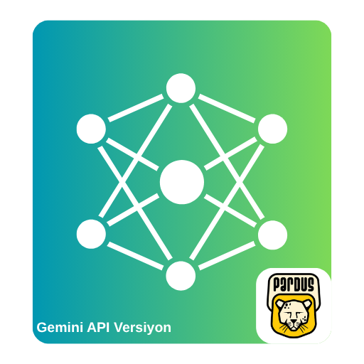
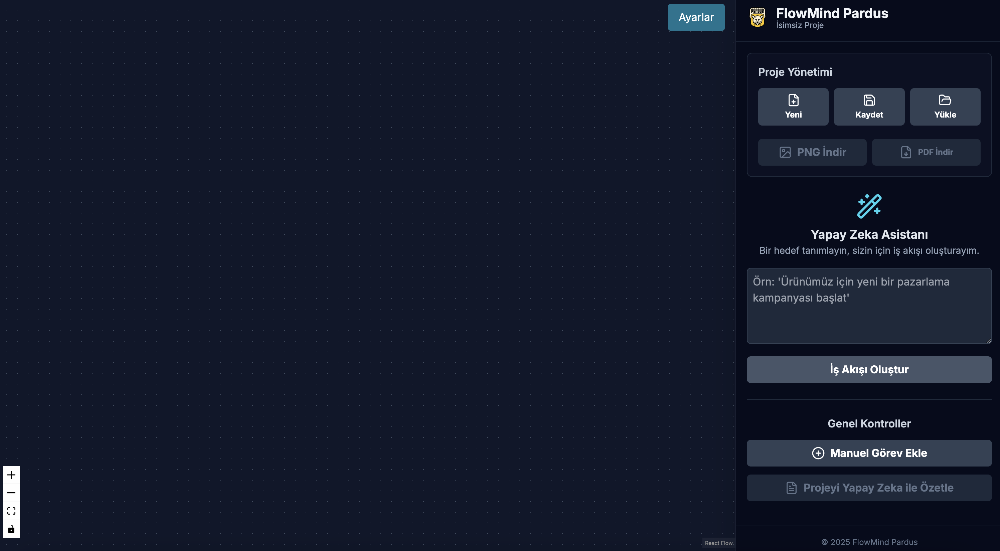
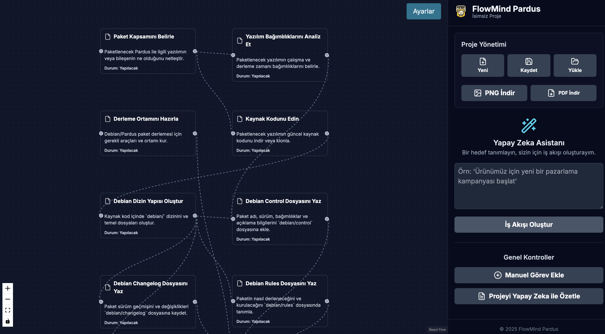

# Pardus Flowmind with Gemini



Pardus Flowmind, düşüncelerinizi ve süreçlerinizi organize etmek için tasarlanmış, yapay zeka destekli bir zihin haritası ve akış diyagramı oluşturma aracıdır. Google Gemini API'nin gücünü sezgisel bir diyagram arayüzüyle birleştirerek yaratıcı süreçlerinizi bir üst seviyeye taşır.

## Amaç

Projenin temel amacı, bireylerin ve takımların beyin fırtınası yapmalarını, proje planlamalarını, not almalarını ve karmaşık bilgileri görselleştirmelerini kolaylaştırmaktır. Yaratıcı düşünce sürecinde karşılaşılan "boş sayfa" sendromunu, yapay zeka destekli önerilerle aşarak kullanıcıların fikirlerini serbestçe ve hızla geliştirebilecekleri dinamik bir ortam sunmayı hedefler.

## Problem

Karmaşık projeler, ders notları veya yaratıcı fikirler üzerinde çalışırken bilgiyi yapılandırmak ve fikirler arası bağlantıları kurmak zorlayıcı olabilir. Geleneksel yöntemler genellikle statiktir ve yaratıcı akışı sınırlar. Pardus Flowmind, bu süreci basitleştirerek şu sorunlara çözüm sunar:

*   **Yaratıcı Tıkanıklık**: Yeni fikirler üretmekte zorlandığınızda, yapay zeka asistanı yeni alt başlıklar ve bağlantılı konular önererek size ilham verir.
*   **Dağınık Bilgi**: Farklı fikirleri ve görevleri tek bir görsel harita üzerinde toplayarak büyük resmi görmenizi sağlar.
*   **Verimsiz Planlama**: Proje adımlarını veya bir konunun ana hatlarını manuel olarak oluşturmak yerine, Gemini'dan sizin için bir taslak hazırlamasını isteyerek zamandan tasarruf etmenizi sağlar.

## Temel Özellikler

Projenin kod tabanını analiz ederek öne çıkan özellikleri aşağıda listeledik:

*   **Sezgisel Diyagram Arayüzü**: `ReactFlow` kütüphanesi sayesinde sürükle-bırak mantığıyla kolayca yeni düşünce balonları (düğümler) ekleyebilir, bunları birbirine bağlayabilir ve haritanızı serbestçe düzenleyebilirsiniz.
*   **Yapay Zeka Destekli Fikir Üretimi**: Bu, projenin en güçlü özelliğidir. Herhangi bir düşünce balonunu seçip kenar çubuğundaki metin alanına bir komut girerek (örneğin, *"bu konuyu daha basit anlat"* veya *"bu adıma ait alt görevler nelerdir?"*), Gemini'nin anında yeni ve bağlantılı balonlar oluşturmasını sağlayabilirsiniz.
*   **Düğüm Kişiselleştirme**: Her bir düşünce balonunun etiketini ve arka plan rengini kenar çubuğundaki ayarlar üzerinden kolayca değiştirebilir, haritanızı görsel olarak anlamlı hale getirebilirsiniz.
*   **PDF ve PNG Olarak Dışa Aktarma**: Oluşturduğunuz zihin haritalarını, `html-to-image` ve `jspdf` kütüphaneleri sayesinde tek bir tıklamayla yüksek çözünürlüklü PNG veya PDF dosyası olarak dışa aktarabilir, sunumlarınızda veya raporlarınızda kullanabilirsiniz.
*   **Platform Bağımsız Çalışma**: `Electron.js` ile geliştirilen Pardus Flowmind, Pardus başta olmak üzere tüm Linux dağıtımları, Windows ve macOS işletim sistemlerinde yerel bir uygulama olarak sorunsuz çalışır.

## Kullanılan Teknolojiler

-   **Arayüz (Frontend)**:
    -   **Dil**: TypeScript
    -   **Kütüphane**: React
    -   **Diyagram**: ReactFlow
    -   **Stil**: Tailwind CSS
    -   **İkonlar**: Lucide React
-   **Masaüstü Uygulaması (Desktop)**:
    -   **Çatı**: Electron.js
-   **Yapay Zeka (AI)**:
    -   **Servis**: Google Gemini API (`@google/genai`)
-   **Geliştirme Araçları**:
    -   **Derleyici/Paketleyici**: Vite
    -   **Linting**: ESLint
-   **Dışa Aktarma**:
    -   `html-to-image` (PNG için)
    -   `jspdf` (PDF için)

## Kurulum

Projeyi yerel ortamınızda çalıştırmak için `Node.js` ve `npm`'in kurulu olduğundan emin olun.

1.  **Projeyi klonlayın:**
    ```bash
    git clone https://github.com/denizzhansahin/pardus-projeler-teknofest-2025.git
    cd pardus-projeler-teknofest-2025/flowmind-pardus
    ```

2.  **Gerekli bağımlılıkları yükleyin:**
    ```bash
    npm install
    ```

3.  **Geliştirme modunda çalıştırın:**
    Bu komut, hem Vite geliştirme sunucusunu başlatır hem de Electron uygulamasını açar. Kodda yaptığınız değişiklikler anında uygulamaya yansıyacaktır.
    ```bash
    npm run electron:dev
    ```

## Gemini API Nasıl Kullanılır?

Yapay zeka özelliklerini aktif hale getirmek için bir Google Gemini API anahtarına ihtiyacınız vardır.

1.  **API Anahtarı Alın**: Google AI Studio web sitesini ziyaret ederek ücretsiz bir API anahtarı oluşturun.
2.  **Ortam Değişkeni Dosyası Oluşturun**: Projenin ana dizininde (`flowmind-pardus/`) `.env.local` adında bir dosya oluşturun.
3.  **Anahtarı Dosyaya Ekleyin**: Oluşturduğunuz dosyaya API anahtarınızı aşağıdaki formatta yapıştırın:
    ```
    VITE_GEMINI_API_KEY=BURAYA_API_ANAHTARINIZI_YAPISTIRIN
    ```
    Uygulama, `services/geminiService.ts` dosyası aracılığıyla bu anahtarı otomatik olarak okuyacak ve Gemini özelliklerini kullanıma sunacaktır.

## Örnek Kullanım Senaryosu

1.  Uygulamayı başlatın ve boş tuvale çift tıklayarak "Ana Fikir" adında bir başlangıç düğümü oluşturun.
2.  Bu düğüme tıklayarak seçili hale getirin. Kenarda açılan ayarlar panelini göreceksiniz.
3.  Paneldeki metin kutusuna **"Bu fikir için 3 alt başlık öner"** yazın ve "Gönder" butonuna tıklayın.
4.  Gemini'nin oluşturduğu üç yeni düşünce balonunun "Ana Fikir" düğümünüze otomatik olarak bağlandığını izleyin.
5.  Yeni oluşturulan düğümlerden birini seçin, rengini değiştirin ve bu kez **"Bu başlığı detaylandır"** komutunu gönderin.
6.  Fikirleriniz geliştikçe haritanızı düzenleyin ve son halini sağ üstteki butonları kullanarak PNG veya PDF olarak kaydedin.

## Ekran Görüntüleri


*Uygulamanın temiz ve sezgisel ana çalışma alanı.*


*Bir düğüm seçiliyken Gemini'dan fikir isteme ve sonucun anında haritaya eklenmesi.*


*Tamamlanan zihin haritasının PDF veya PNG olarak dışa aktarılma seçenekleri.*

## Takım Bilgisi

-   **Üyeler**: Denizhan Şahin, Mehmet Akınol
-   **Başvuru ID**: 3078008
-   **Takım ID**: 577125
-   **Takım Adı**: Space Teknopoli Linux Team
-   **Yarışma Adı**: 2025 Pardus Hata Yakalama ve Öneri Yarışması Geliştirme Kategorisi