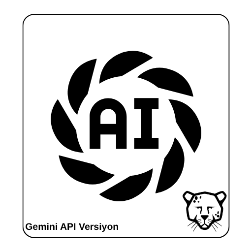
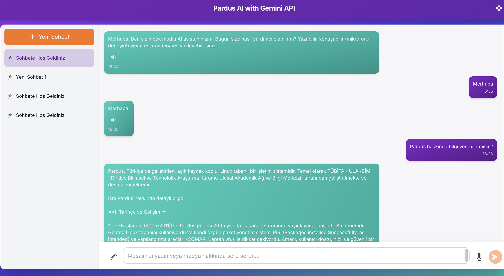
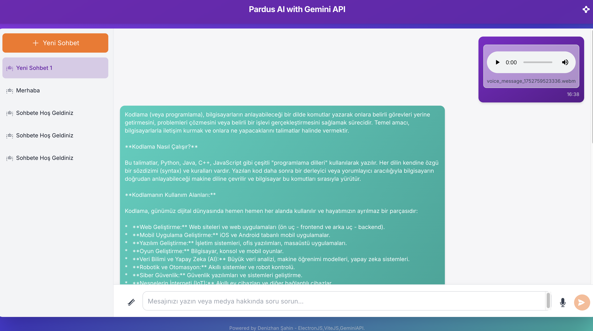
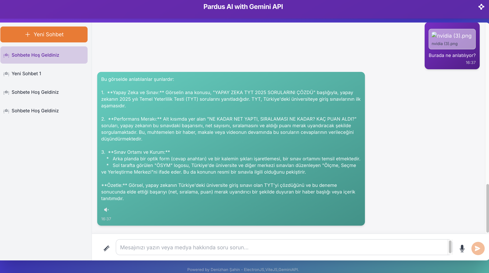
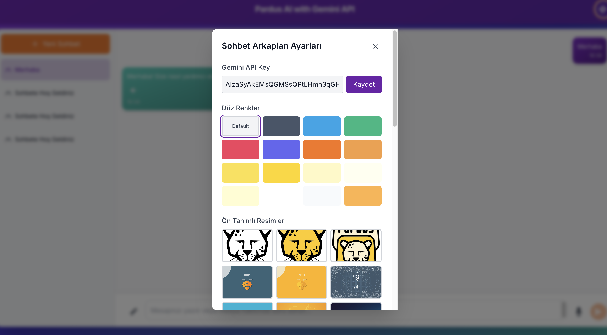

# Pardus Flowmind with Gemini



## 1. Amaç

**Pardus Flowmind with Gemini**, Pardus işletim sistemi için özel olarak tasarlanmış, modern ve çok modlu (metin, ses, görüntü) bir yapay zeka asistanıdır. Bu projenin temel amacı, kullanıcılara günlük görevlerinde yardımcı olacak, bilgiye erişimi kolaylaştıracak ve yaratıcılıklarını destekleyecek akıllı bir masaüstü uygulaması sunmaktır. Google'ın güçlü **Gemini API**'sini kullanarak, Pardus ekosistemine yenilikçi bir yapay zeka deneyimi kazandırmayı hedeflemektedir.

## 2. Problem

Pardus kullanıcıları için, işletim sistemiyle bütünleşik çalışan, modern arayüzlü ve aynı anda birden fazla veri türünü (metin, ses, görüntü) işleyebilen gelişmiş bir yapay zeka asistanı eksikliği mevcuttur. Kullanıcıların farklı ihtiyaçlar için birden fazla uygulama kullanması gerekebilmekte, bu da verimliliği düşürmektedir. **Pardus Flowmind**, bu boşluğu doldurarak tüm bu yetenekleri tek bir çatı altında toplamayı ve Pardus kullanıcılarına akıcı bir deneyim sunmayı amaçlamaktadır.

## 3. Yöntem ve Proje Mimarisi

Proje, **Electron** çerçevesi kullanılarak geliştirilmiş bir çapraz platform masaüstü uygulamasıdır. Bu sayede web teknolojilerinin esnekliği ile masaüstü uygulamalarının gücü birleştirilmiştir.

### Temel Mimarisi:

-   **Ana Uygulama Kabuğu (Electron)**: `electron.cjs` dosyası, uygulamanın ana sürecini yönetir. Pencere oluşturma, paketleme ve üretim/geliştirme ortamı yönetimi gibi temel masaüstü işlevlerinden sorumludur.
-   **Kullanıcı Arayüzü (React)**: Arayüz, **React** ve **TypeScript** kullanılarak bileşen tabanlı bir yaklaşımla geliştirilmiştir. `App.tsx` ana bileşendir ve tüm diğer arayüz bileşenlerini (sohbet penceresi, mesaj listesi, giriş alanı vb.) yönetir.
-   **Durum Yönetimi (React Hooks)**: Uygulama genelindeki durum (state) yönetimi, React'in kendi `useState`, `useEffect`, `useCallback` gibi kancaları (hooks) ile sağlanır. Sohbet geçmişi, aktif konuşma, yükleniyor durumu gibi tüm veriler `App.tsx` içinde yönetilir ve ilgili bileşenlere `props` aracılığıyla aktarılır.
-   **Stil (Tailwind CSS)**: Hızlı ve modern bir arayüz için **Tailwind CSS** kullanılmıştır.

### Bileşen Yapısı (`/components`):

Uygulama, yeniden kullanılabilir ve modüler bileşenlerden oluşur:

-   `ChatHistorySidebar.tsx`: Geçmiş sohbetleri listeler ve yönetir.
-   `MessageList.tsx`: Mesajları görüntüler.
-   `MessageItem.tsx`: Tek bir sohbet balonunu temsil eder.
-   `ChatInput.tsx`: Kullanıcının metin, dosya ve ses girişi yapmasını sağlar.
-   `VoiceRecordingModal.tsx`: Ses kaydı için arayüz sunar.
-   `BackgroundSettingsModal.tsx`: Sohbet arka planını özelleştirme imkanı tanır.

### Çok Modlu Yetenekler:

-   **Metin**: Kullanıcı metin girişi yapar ve Gemini API'den metin tabanlı yanıtlar alır.
-   **Görüntü**: Kullanıcılar görüntü dosyaları yükleyebilir. Bu dosyalar `geminiService.ts` içinde Base64 formatına çevrilerek Gemini Vision modeline gönderilir.
-   **Ses**:
    -   **Ses Tanıma**: `useSpeechRecognition.ts` hook'u, tarayıcının `MediaRecorder` API'sini kullanarak kullanıcının sesini kaydeder. Kaydedilen ses, bir `Blob` nesnesi olarak `geminiService.ts`'e gönderilir ve burada Base64'e çevrilerek Gemini API'ye iletilir.
    -   **Ses Sentezleme**: `useSpeechSynthesis.ts` hook'u, tarayıcının `SpeechSynthesis` API'sini kullanarak yapay zekanın metin yanıtlarını sesli olarak okur.

## 4. Veri Yapıları (`types.ts`)

Projedeki temel veri yapıları, `types.ts` dosyasında merkezi olarak tanımlanmıştır. Bu, kodun tamamında tutarlı ve yeniden kullanılabilir veri modelleri sağlar.

-   `ChatMessage`: Bir sohbet mesajının tüm özelliklerini (ID, metin, gönderen, zaman damgası, medya ekleri vb.) içerir.
-   `Conversation`: Bir sohbet oturumunu temsil eder; bir başlık, mesaj dizisi ve zaman damgaları içerir.
-   `MediaAttachment`: Mesajlara eklenen medya dosyalarının (resim, video, ses) türünü ve verisini tutar.
-   `Sender`: Mesajın kimden geldiğini belirtir (`User`, `AI`, `System`).

## 5. Kullanılan Teknolojiler

-   **Programlama Dilleri**: TypeScript, JavaScript
-   **Masaüstü Çerçevesi**: Electron
-   **Frontend Kütüphanesi**: React
-   **API**: Google Gemini API (`@google/genai`)
-   **Stil**: Tailwind CSS
-   **Derleme ve Geliştirme Aracı**: Vite
-   **Paket Yöneticisi**: npm
-   **Linting**: ESLint

## 6. Kurulum ve Geliştirme

### Gerekli Ortam

-   Node.js (LTS sürümü önerilir)
-   npm (Node.js ile birlikte gelir)

### Adımlar

1.  **Projeyi klonlayın:**
    ```bash
    git clone https://github.com/denizzhansahin/pardus-projeler-teknofest-2025.git
    cd pardus-projeler-teknofest-2025/multimodal-ai-chatbot-gemini
    ```

2.  **Gerekli bağımlılıkları yükleyin:**
    ```bash
    npm install
    ```

3.  **Uygulamayı geliştirme modunda başlatın:**
    Bu komut, hem Vite geliştirme sunucusunu hem de Electron uygulamasını aynı anda başlatır.
    ```bash
    npm run electron:dev
    ```

### Uygulamayı Paketleme

Uygulamayı dağıtılabilir bir paket haline getirmek için aşağıdaki komutları kullanabilirsiniz:

-   **Tüm platformlar için (mevcut işletim sistemine göre):**
    ```bash
    npm run electron:build
    ```
-   **Windows için:**
    ```bash
    npm run electron:build-win
    ```
-   **Linux için (AppImage, deb):**
    ```bash
    npm run electron:build-linux
    ```

Paketlenen dosyalar `release` klasöründe oluşturulacaktır.

## 7. Gemini API Nasıl Kullanılır?

Proje, yapay zeka yetenekleri için Google Gemini API'sini kullanır. API entegrasyonu `services/geminiService.ts` dosyası üzerinden yönetilir.
Yapay zeka özelliklerini aktif hale getirmek için bir Google Gemini API anahtarına ihtiyacınız vardır.

1.  **API Anahtarı Alın**: Google AI Studio web sitesini ziyaret ederek ücretsiz bir API anahtarı oluşturun.
2.  **API Anahtarını Ekleyin**: Projenin açılışında "Ayarlar" butonuna tıklayın API anahtarınızı yazınız, daha sonra sayfa yenileme işlemi için gelen uyarıyı kabul edin.

## 8. Ekran Görüntüleri

*Projenin arayüzünü ve temel işlevlerini gösteren ekran görüntüleri aşağıdadır.*


*Ana sohbet ekranı, mesajlaşma akışı ve yan paneldeki sohbet geçmişi.*


*Mikrofon butonu ile sesli komut kaydı yapma.*


*Çok modlu yetenekler: Görüntü yükleyerek soru sorma.*


*Duvar kağıdı, API key ve arkaplan rengi seçenekleri kullanılır.*

## 9. Takım Bilgisi

-   **Üyeler**: Denizhan Şahin, Mehmet Akınol
-   **Başvuru ID**: 3078008
-   **Takım ID**: 577125
-   **Takım Adı**: Space Teknopoli Linux Team
-   **Yarışma Adı**: 2025 Pardus Hata Yakalama ve Öneri Yarışması Geliştirme Kategorisi