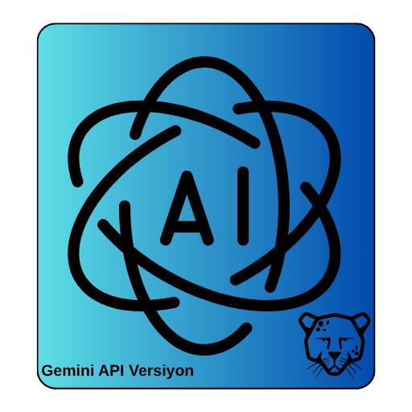

# Pardus AI Agent



## Amaç

Pardus AI Agent, Pardus işletim sistemi üzerinde kullanıcıların doğal dil ile verdiği komutları anlayarak bunları doğrudan sistem üzerinde çalıştırılabilir eylemlere dönüştüren bir yapay zeka ajanıdır. Projenin temel amacı, karmaşık veya rutin sistem yönetimi ve geliştirme görevlerini basitleştirmek, kullanıcıların teknik komutları hatırlama zorunluluğunu ortadan kaldırarak verimliliği artırmaktır. Ajan, dosya oluşturma, kod analizi, paket yönetimi ve komut satırı işlemleri gibi görevleri otonom bir şekilde yerine getirebilir.

## Problem

Geliştiriciler, sistem yöneticileri ve hatta son kullanıcılar, sık sık tekrar eden veya ezberlenmesi zor olan komutlarla çalışmak zorunda kalır. Görevleri otomatikleştirmek için betikler (script) yazmak zaman alıcı olabilir ve her durum için esnek çözümler sunmayabilir. Bu proje, kullanıcıların "bana bir web sunucusu kur" veya "projedeki tüm testleri çalıştır" gibi basit cümlelerle karmaşık işlemleri gerçekleştirmesine olanak tanıyarak bu problemi çözmeyi hedefler. Bu sayede, teknik bilgi seviyesi ne olursa olsun tüm kullanıcılar için Pardus deneyimini daha akıcı ve erişilebilir hale getirir.

## Yöntem

Proje, kullanıcıdan gelen doğal dil komutlarını alıp bunları çalıştırılabilir Python koduna çevirmek için Google'ın güçlü **Gemini 1.5 Flash** modelini kullanır. Sistemin çalışma mimarisi aşağıdaki adımlardan oluşur:

1.  **API Sunucusu (`serve_api.py`):** Proje, bir Flask web sunucusu aracılığıyla dış dünya ile iletişim kurar. Kullanıcılar, `/execute` endpoint'ine JSON formatında bir `prompt` (istek) gönderir.
2.  **Yapay Zeka Çekirdeği (`agent/ai_core.py`):** Gelen istek, `AICore` sınıfına iletilir. Bu sınıf, kullanıcı isteğini Gemini API'nin anlayacağı şekilde biçimlendirir ve modelden bu isteği yerine getirecek Python kodunu üretmesini talep eder.
3.  **Eylem Yürütücü (`agent/action_executor.py`):** Gemini tarafından üretilen Python kodu, `ActionExecutor` sınıfına gönderilir. Bu sınıf, gelen kodu `exec()` fonksiyonu kullanarak güvenli bir ortamda çalıştırır. Kodun çalışması sırasında oluşan çıktılar (stdout) ve hatalar (stderr) yakalanır.
4.  **Yanıt Döndürme:** Çalıştırılan kodun sonucu, çıktılar ve olası hatalar ile birlikte kullanıcıya JSON formatında geri döndürülür.

Bu yöntem sayesinde ajan, sadece önceden tanımlanmış görevleri değil, aynı zamanda Gemini modelinin yetenekleri dahilinde anlık olarak üretilen her türlü dinamik görevi yerine getirebilir.

## Kullanılan Teknolojiler

*   **Programlama Dili:** Python 3
*   **Yapay Zeka Modeli:** Google Gemini 1.5 Flash
*   **Web Framework:** Flask (API sunucusu için)
*   **Ana Kütüphaneler:**
    *   `google-generativeai`: Google Gemini API ile etkileşim için.
    *   `Flask` & `Werkzeug`: HTTP isteklerini yönetmek ve API endpoint'lerini sunmak için.
    *   `Flask-Cors`: Tarayıcı tabanlı istemcilerden gelen isteklere izin vermek için.

## Kurulum

Projeyi yerel ortamınızda kurmak ve çalıştırmak için aşağıdaki adımları izleyebilirsiniz:

1.  **Projeyi Klonlayın:**
    ```bash
    git clone https://github.com/kullaniciadi/pardus-ai-agent.git
    cd pardus-ai-agent
    ```

2.  **Python Sanal Ortamı Oluşturun (Önerilir):**
    ```bash
    python3 -m venv venv
    source venv/bin/activate
    ```

3.  **Gerekli Bağımlılıkları Yükleyin:**
    ```bash
    pip install -r requirements.txt
    ```

4.  **Projeyi Sisteme Kurun:**
    `setup.py` dosyası, projenin paket olarak kurulmasını sağlar.
    ```bash
    python setup.py install
    ```

5.  **API Sunucusunu Başlatın:**
    Ajanı aktif hale getirmek için API sunucusunu çalıştırın.
    ```bash
    python serve_api.py
    ```
    Sunucu varsayılan olarak `http://127.0.0.1:5000` adresinde çalışmaya başlayacaktır.

## Gemini API Nasıl Kullanılır?

Proje, Gemini API ile `agent/ai_core.py` dosyasındaki `AICore` sınıfı üzerinden etkileşim kurar.

-   **Başlatma:** `AICore` başlatıldığında, `gemini-1.5-flash` modelini kullanacak şekilde yapılandırılır.
-   **İstek Gönderme:** `execute_action` metodu, kullanıcıdan gelen isteği alır ve Gemini modeline gönderir. Modelden, bu isteği karşılayacak Python kodunu üretmesi istenir.
-   **API Anahtarı:** Gemini API'yi kullanabilmek için bir Google API anahtarına ihtiyacınız vardır. Bu anahtarı projenin ana dizininde bir `config.json` dosyası oluşturarak veya bir ortam değişkeni (`GEMINI_API_KEY`) olarak tanımlayarak sisteme tanıtmalısınız.

**Örnek `config.json`:**
```json
{
  "api_key": "BURAYA_API_ANAHTARINIZI_GIRIN"
}
```

## Güvenlik Notları

Bu proje, yapay zeka tarafından üretilen kodu doğrudan sistem üzerinde çalıştırdığı için doğası gereği büyük bir güce sahiptir. `ActionExecutor` modülü, `exec()` fonksiyonunu kullanarak kodları yürütür. Bu, esneklik sağlarken aynı zamanda önemli bir güvenlik riski oluşturur. Üretilen kodun dosya sisteminize veya kişisel verilerinize zarar verme potansiyeli bulunmaktadır.

Bu nedenle, projeyi çalıştırırken dikkatli olunmalı ve ajana verilen komutların sonuçları göz önünde bulundurulmalıdır. Projenin mevcut hali, kontrollü bir geliştirme ortamında kullanım için daha uygundur.

## Ekran Görüntüleri

Projenin nasıl çalıştığını gösteren bazı örnekler aşağıda yer almaktadır.

*Ajanın bir terminal gibi bir araç üzerinden kullanımı:*
``

*Ajanın karmaşık bir görevi yerine getirmesi:*
``

*Ajanın karmaşık bir görevi yerine getirmesi:*
``

## Takım Bilgisi

*   **Üyeler:** Denizhan Şahin, Mehmet Akınol
*   **Başvuru ID:** 3078008
*   **Takım ID:** 577125
*   **Takım Adı:** Space Teknopoli Linux Team
*   **Yarışma Adı:** 2025 Pardus Hata Yakalama ve Öneri Yarışması Geliştirme Kategorisi