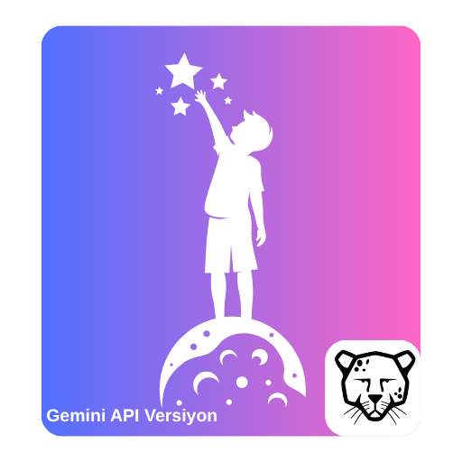
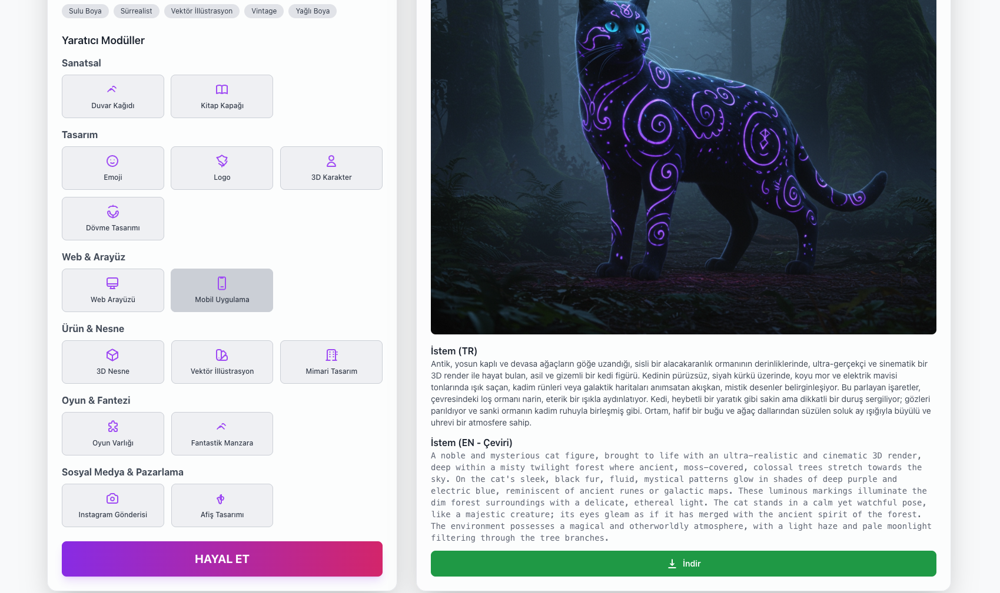
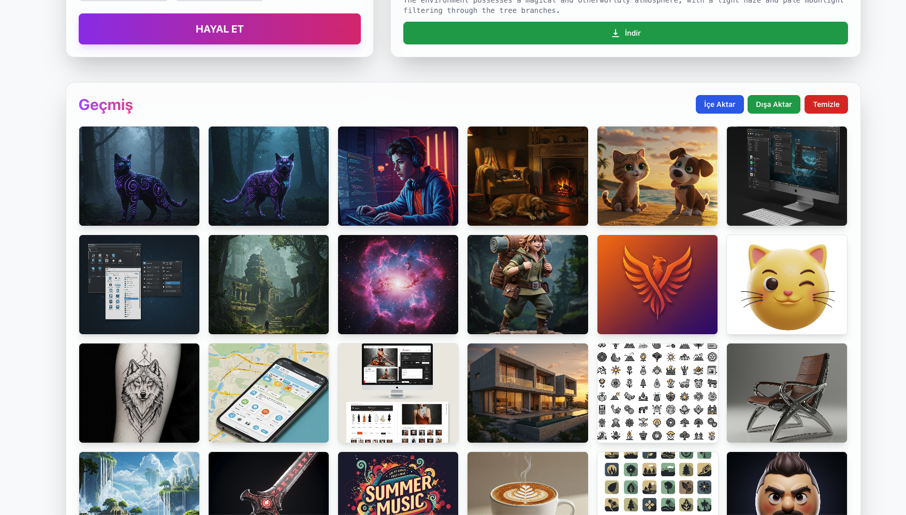
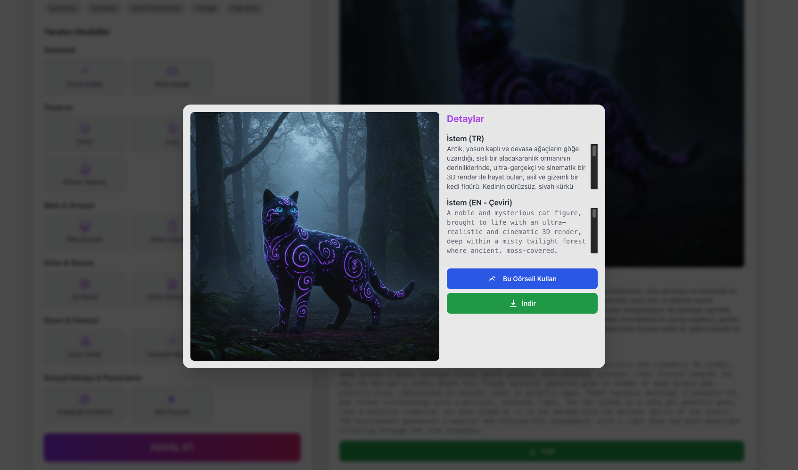

# Pardus Dream: AI Görsel Stüdyosu



**Pardus Dream**, Pardus kullanıcıları için tasarlanmış, hayal gücünüzü gerçeğe dönüştüren, yapay zeka destekli bir görsel içerik üretme stüdyosudur. Bu uygulama ile metin tabanlı komutlar (prompt) kullanarak benzersiz görseller yaratabilir, mevcut görsellerden ilham alarak yeni varyasyonlar oluşturabilir ve yaratıcılığınızı ateşleyecek fikirler edinebilirsiniz.

## Amaç ve Kapsam

Bu projenin temel amacı, Pardus işletim sistemi kullanıcılarına, yapay zeka ile görsel üretme sürecini **basit, sezgisel ve entegre** bir masaüstü deneyimiyle sunmaktır. Pardus Dream, karmaşık web arayüzlerine veya teknik bilgiye ihtiyaç duymadan, her seviyeden kullanıcının kendi yaratıcı potansiyelini ortaya çıkarmasını hedefler.

## Çözülen Problem

Yapay zeka tabanlı görsel üretim araçları genellikle web tabanlıdır ve stabil bir internet bağlantısı gerektirir. Ayrıca, bu platformlar işletim sistemiyle entegre çalışmaz ve yerel bir iş akışı sunmaz. Pardus kullanıcıları için bu alanda özelleşmiş, çevrimdışı yeteneklere sahip ve Pardus estetiğiyle uyumlu bir masaüstü uygulaması eksikliği vardı. **Pardus Dream**, bu boşluğu doldurarak, kullanıcılara doğrudan kendi bilgisayarlarından, daha akıcı ve kişisel bir yaratım süreci sunar.

## Temel Özellikler

Projenin kod yapısını inceleyerek öne çıkan özellikleri aşağıda listeledim:

*   **Metinden Görsel Üretimi**: Basit veya karmaşık metin istemleri yazarak yüksek kalitede görseller oluşturun.
*   **Görselden Görsel Üretimi (Image-to-Image)**: Mevcut bir görseli temel alarak ve ek istemler girerek yeni varyasyonlar ve kompozisyonlar yaratın.
*   **Akıllı İstem Geliştirme**: Tek bir tıklama ile basit istemlerinizi daha **zengin, detaylı ve yaratıcı** hale getirin.
*   **İlham Veren Fikirler**: Yaratıcı bir başlangıç noktası aradığınızda, girdiğiniz bir anahtar kelimeye dayalı olarak size **alternatif istem fikirleri** sunar.
*   **Yaratıcı Modüller ve Stil Önerileri**: "Karakter Tasarımı", "Logo Dizaynı", "Manzara" gibi hazır modüller ve "Sinematik", "Vektör Sanatı" gibi stil önerileriyle yaratım sürecinizi hızlandırın.
*   **Yerel Galeri ve Geçmiş Yönetimi**: Ürettiğiniz tüm görseller, istemleriyle birlikte yerel olarak bilgisayarınızda saklanır.
    *   **Geçmişi İçe/Dışa Aktarma**: Tüm görsel geçmişinizi bir `.json` dosyası olarak yedekleyin veya başka bir cihaza taşıyın.
    *   Görselleri kolayca silin veya tüm geçmişi temizleyin.
*   **Etkileşimli Arayüz**: Üretilen görselleri modal pencerede görüntüleyin, bilgisayarınıza indirin veya yeni bir üretim için temel olarak kullanın.
*   **Pardus Uyumlu Modern Tasarım**: Vite, React ve Tailwind CSS ile geliştirilmiş, akıcı ve estetik bir kullanıcı arayüzü.

## Yöntem ve Mimarisi

Pardus Dream, modern ve platform bağımsız bir teknoloji yığını üzerine inşa edilmiştir:

-   **Uygulama Çatısı**: **Electron**, web teknolojileriyle (React, TypeScript) güçlü bir masaüstü uygulaması oluşturmak için kullanılır.
-   **Arayüz**: **React** ile bileşen tabanlı bir yapı kurulmuş, **Vite** ile geliştirme ve derleme süreçleri hızlandırılmıştır. **Tailwind CSS**, tasarıma esneklik ve tutarlılık katmaktadır.
-   **Yapay Zeka Entegrasyonu**: Uygulamanın kalbinde **Google Gemini API** yer alır.
    -   `imagen-3.0-generate-002`: Metinden ve görselden görsel üretimi için kullanılır.
    -   `gemini-2.5-flash`: İstem geliştirme, görsel analizi, çeviri ve fikir üretme gibi daha hızlı ve metin odaklı görevler için tercih edilir.
-   **Durum Yönetimi ve Veri Kalıcılığı**: `useHistory` custom hook'u, üretilen görsellerin ve istemlerin `localStorage` üzerinde kalıcı olarak saklanmasını yönetir. Bu sayede uygulama kapatılıp açıldığında veriler kaybolmaz.

## Kullanılan Teknolojiler

-   **Programlama Dili**: TypeScript
-   **Frontend**: React, Vite
-   **Masaüstü Çerçevesi**: Electron
-   **Styling**: Tailwind CSS, Lucide React (İkonlar)
-   **Yapay Zeka API**: Google Gemini API (`@google/genai`)
-   **Paket Yöneticisi**: npm

## Kurulum

Projeyi yerel ortamınızda kurmak ve çalıştırmak için aşağıdaki adımları izleyin:

1.  **Projeyi klonlayın:**
    ```bash
    git clone https://github.com/denizzhansahin/pardus-projeler-teknofest-2025.git
    cd pardus-dream
    ```

2.  **Gerekli paketleri yükleyin:**
    ```bash
    npm install
    ```

3.  **Geliştirme modunda çalıştırın:**
    Bu komut, Vite geliştirme sunucusunu ve Electron uygulamasını eş zamanlı olarak başlatır.
    ```bash
    npm run electron:dev
    ```

## Gemini API Nasıl Kullanılır?

Uygulamanın tüm yapay zeka yetenekleri, `services/geminiService.ts` dosyası üzerinden yönetilir ve Google Gemini API'sini kullanır.

1.  **API Anahtarı Kurulumu**: Uygulamayı kullanmaya başlamadan önce, bir Google Gemini API anahtarına sahip olmanız gerekir. Uygulamanın sağ üst köşesindeki **Ayarlar** ikonuna tıklayarak açılan pencereye API anahtarınızı girmelisiniz. Bu anahtar, güvenli bir şekilde sadece sizin bilgisayarınızda saklanır.
2.  **API Fonksiyonları**:
    -   `generateImage`: Metin istemini ve (varsa) temel görsel tanımını alıp **Imagen 3** modeline göndererek görsel üretir.
    -   `describeImage`: Bir görseli base64 formatına çevirip **Gemini 2.5 Flash** modeline göndererek görselin detaylı bir tanımını alır. Bu tanım, görselden görsel üretme sürecinde kullanılır.
    -   `enhancePrompt` ve `getPromptIdeas`: Metin istemlerini zenginleştirmek ve yeni fikirler üretmek için **Gemini 2.5 Flash** modelinin metin üretme yeteneğinden faydalanır.
    -   `translatePrompt`: Türkçe girilen istemleri, görsel üretim modelinin daha verimli çalışması için İngilizce'ye çevirir.

## Ekran Görüntüleri

*Projenin arayüzüne ait örnek ekran görüntüleri aşağıdadır.*


*Yaratıcı modüller, istem giriş alanı ve üretilen görselin sergilendiği ana ekran.*


*Üretilen görsellerin ve geçmişin yönetildiği galeri bölümü.*



*Üretilen görsellerin ve geçmişin yönetildiği galeri bölümü.*


## Takım Bilgisi

-   **Üyeler**: Denizhan Şahin, Mehmet Akınol
-   **Başvuru ID**: 3078008
-   **Takım ID**: 577125
-   **Takım Adı**: Space Teknopoli Linux Team
-   **Yarışma Adı**: 2025 Pardus Hata Yakalama ve Öneri Yarışması Geliştirme Kategorisi