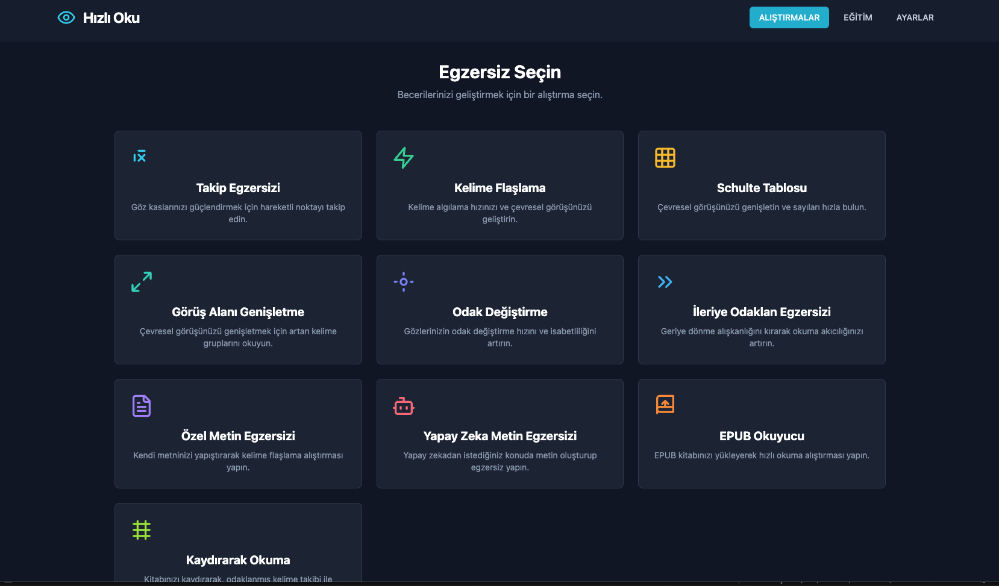
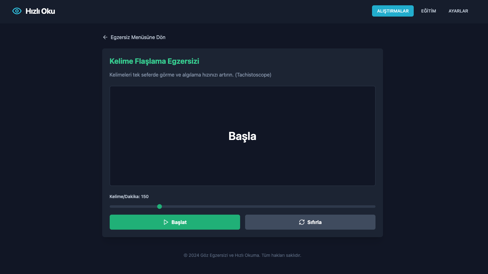
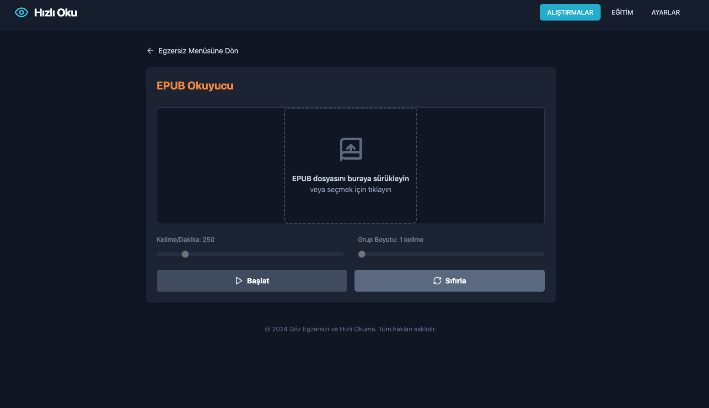
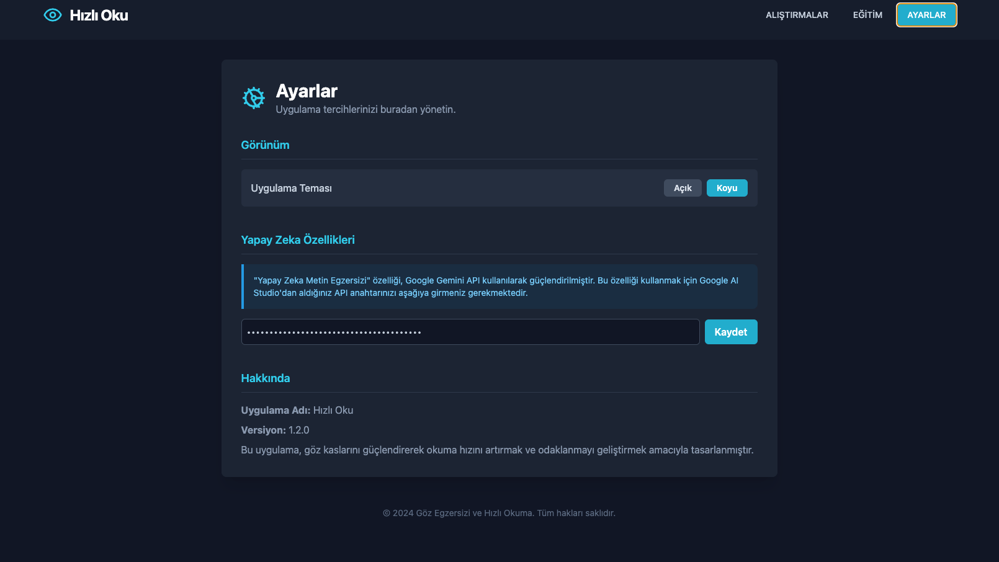

# Pardus Hızlı Okuma ve Göz Egzersizi


## Amaç

Bu proje, kullanıcıların okuma hızlarını ve anlama becerilerini geliştirmelerine yardımcı olmak, aynı zamanda dijital ekran kullanımından kaynaklanan göz yorgunluğunu azaltmaya yönelik kapsamlı bir masaüstü uygulamasıdır. Modern hızlı okuma tekniklerini ve bilimsel göz egzersizlerini interaktif bir platformda birleştirerek, bireylerin okuma alışkanlıklarını daha verimli ve sağlıklı hale getirmeyi hedefler.

## Problem

Günümüz bilgi çağında, bireyler yoğun bilgi akışıyla karşı karşıyadır ve bu durum, okuma hızının yetersiz kalmasına neden olabilmektedir. Geleneksel okuma alışkanlıkları (kelime kelime okuma, geri sıçramalar, iç seslendirme) okuma hızını sınırlar. Ayrıca, uzun süreli dijital ekran maruziyeti, göz yorgunluğu, kuruluk ve odaklanma güçlüğü gibi göz sağlığı sorunlarına yol açmaktadır. Bu proje, bu iki temel problemi ele alarak, hem okuma verimliliğini artırmayı hem de göz sağlığını korumayı amaçlar.

## Yöntem

Proje, hızlı okuma ve göz egzersizlerini modüler bir yaklaşımla sunar. Kullanıcılar, aşağıdaki temel egzersiz türleri aracılığıyla becerilerini geliştirebilirler:

*   **Yapay Zeka Metin Egzersizi**: Belirlenen bir konu ve uzunlukta yapay zeka tarafından oluşturulan metinlerle okuma pratiği.
*   **Özel Metin Egzersizi**: Kullanıcıların kendi metinlerini yapıştırarak okuma hızlarını ayarlayabildiği kişiselleştirilmiş egzersiz.
*   **EPUB Okuyucu**: EPUB formatındaki e-kitapları yükleyerek hızlı okuma tekniklerini uygulama imkanı.
*   **Görüş Alanı Genişletme**: Gözlerin tek bakışta daha fazla kelimeyi algılamasını sağlayan, merkezi odaklanmayı geliştiren egzersiz.
*   **Kelime Flaşlama (Tachistoscope)**: Kısa süreli kelime gösterimleriyle görsel algı ve tanıma hızını artıran egzersiz.
*   **İleriye Odaklan Egzersizi**: Geriye dönme alışkanlığını kırarak metin üzerinde sürekli ileri akışı teşvik eden egzersiz.
*   **Odak Değiştirme Egzersizi**: Ekranda rastgele beliren öğelere hızlıca odaklanarak göz kaslarını ve dikkat süresini geliştiren egzersiz.
*   **Takip Egzersizi**: Hareketli bir noktayı gözlerle takip ederek göz kaslarının esnekliğini ve koordinasyonunu artıran egzersiz.
*   **Schulte Tablosu**: Çevresel görüşü ve odaklanmayı geliştiren, sayıları sırayla bulma egzersizi.

Uygulama, kullanıcı dostu bir arayüze sahiptir ve ilerleme takibi için temel mekanizmalar sunar.

## Kullanılan Teknolojiler

*   **Frontend**: React, TypeScript (Modern ve performanslı kullanıcı arayüzleri için)
*   **Styling**: Tailwind CSS (Hızlı ve esnek UI geliştirme için utility-first CSS framework'ü)
*   **Build Tool**: Vite (Hızlı geliştirme sunucusu ve optimize edilmiş üretim derlemeleri için)
*   **Desktop Framework**: Electron (Web teknolojileriyle çapraz platform masaüstü uygulamaları geliştirmek için)
*   **EPUB Parsing**: epubjs (EPUB dosyalarını ayrıştırma ve içeriklerini işleme yeteneği sağlar)
*   **AI Integration**: @google/genai (Yapay zeka destekli metin oluşturma özellikleri için Google Gemini API entegrasyonu)
*   **Package Manager**: npm (Proje bağımlılıklarını yönetmek için)

## Kurulum

Projeyi yerel ortamınızda çalıştırmak için aşağıdaki adımları takip edin:

1.  Projeyi klonlayın:
    ```bash
    git clone https://github.com/denizzhansahin/pardus-projeler-teknofest-2025.git
    cd pardus-projeler-teknofest-2025/pardus-göz-egzersizi-ve-hizli-okuma-programi
    ```
2.  Bağımlılıkları yükleyin:
    ```bash
    npm install
    ```
3.  **Geliştirme modunda çalıştırmak için (önerilen)**:
    ```bash
    npm run electron:dev
    ```
    *Not: `npm run electron:build` komutu şu anda tam olarak işlevsel değildir ve uygulama derlendikten sonra beklenmedik davranışlar sergileyebilir. Geliştirme ve test süreçleri için lütfen `electron:dev` komutunu kullanın.* 

## Gemini API Nasıl Kullanılır?

Bu proje, yapay zeka destekli metin oluşturma egzersizi için Google Gemini API'sini kullanmaktadır. Gemini API'yi kullanabilmek için bir API anahtarına ihtiyacınız vardır.

1.  Bir Gemini API anahtarı edinin. (Google AI Studio üzerinden edinebilirsiniz.)
2.  Projenin ayarlar bölümüne API key bilgisini ekleyiniz.
3.  Uygulama, `AITextExercise.tsx` bileşeninde bu anahtarı kullanarak metin oluşturma istekleri yapacaktır.

## Ekran Görüntüleri







## Takım Bilgisi

*   **Üyeler**: Denizhan Şahin, Mehmet Akınol
*   **Başvuru ID**: 3078008
*   **Takım ID**: 577125
*   **Takım Adı**: Space Teknopoli Linux Team
*   **Yarışma Adı**: 2025 Pardus Hata Yakalama ve Öneri Yarışması Geliştirme Kategorisi