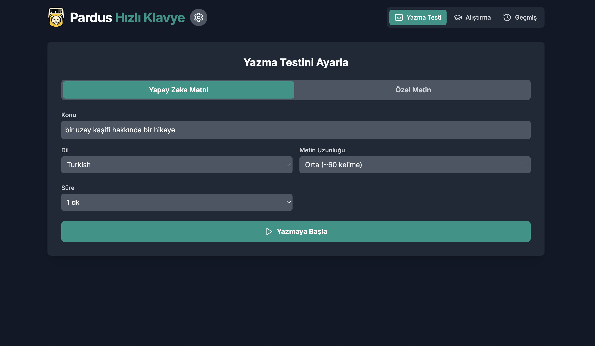
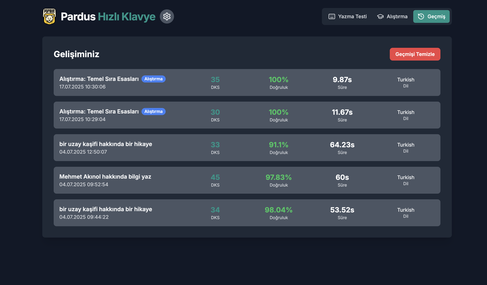
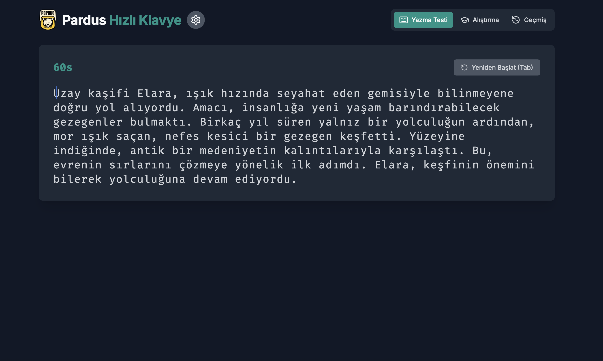
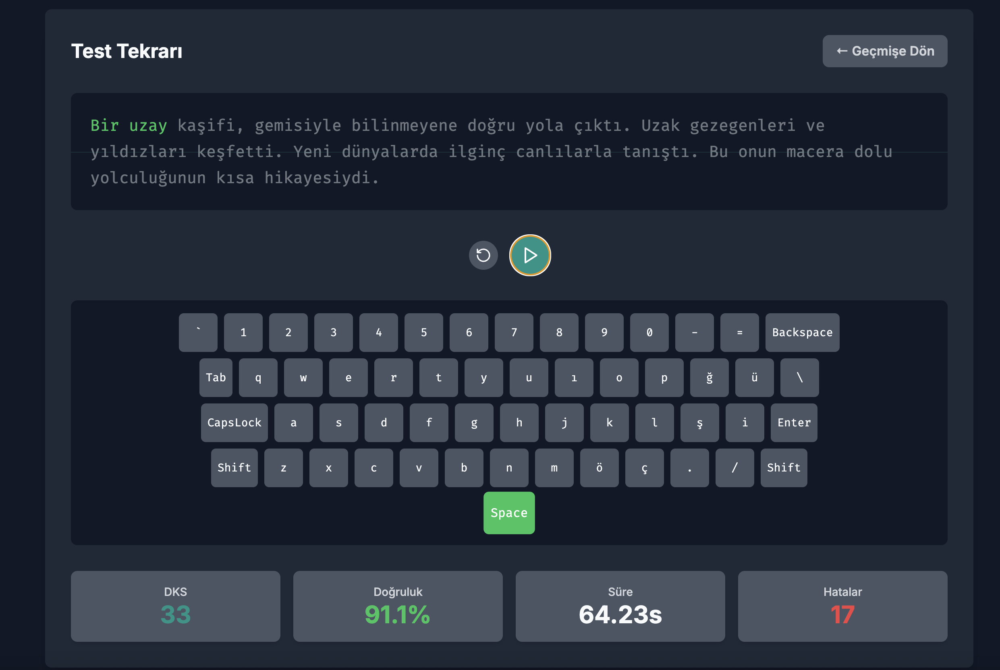
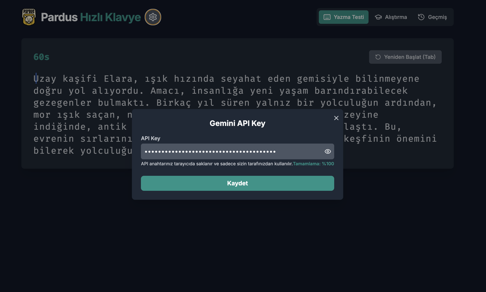

# Pardus Hızlı Klavye


## Amaç

Bu proje, kullanıcıların klavye yazma hızlarını ve doğruluğunu geliştirmelerine yardımcı olmak amacıyla geliştirilmiştir. Hızlı ve doğru yazma becerilerini artırarak, dijital ortamda daha verimli olmayı hedefler.

## Problem

Günümüz dijital çağında, bilgisayar başında geçirilen sürenin artmasıyla birlikte klavye kullanım becerileri büyük önem kazanmıştır. Yavaş ve hatalı yazma, verimliliği düşürür ve zaman kaybına yol açar. Bu proje, kullanıcıların bu temel problemi interaktif ve etkili bir şekilde çözmelerine yardımcı olmayı amaçlamaktadır.

## Yöntem

Proje, kullanıcıların yazma becerilerini geliştirmeleri için çeşitli zorluk seviyelerinde klavye testleri sunar. Kullanıcılar, belirli metinleri yazarak hızlarını (WPM - Words Per Minute) ve doğruluklarını ölçebilirler. Uygulama, kullanıcı deneyimini zenginleştirmek için modern bir arayüzle tasarlanmıştır ve yapay zeka destekli metin oluşturma ve ipuçları sunma yeteneğine sahiptir.

## Kullanılan Teknolojiler

*   **Electron**: Çapraz platform masaüstü uygulamaları geliştirmek için kullanılan framework.
*   **React**: Kullanıcı arayüzleri oluşturmak için kullanılan JavaScript kütüphanesi.
*   **TypeScript**: JavaScript'e tip güvenliği ekleyen ve büyük ölçekli uygulamaların geliştirilmesini kolaylaştıran dil.
*   **Vite**: Hızlı geliştirme deneyimi sunan yeni nesil bir frontend build aracı.
*   **HTML/CSS**: Uygulamanın yapısal ve stilistik temelleri.
*   **Node.js**: Electron uygulamalarının arka plan süreçlerini yönetmek için kullanılan çalışma zamanı ortamı.

## Kurulum

Projeyi yerel ortamınızda çalıştırmak için aşağıdaki adımları takip edin:

1.  Projeyi klonlayın:
    ```bash
    git clone https://github.com/your-username/pardus-hizli-klavye.git
    ```
2.  Proje dizinine gidin:
    ```bash
    cd pardus-hizli-klavye
    ```
3.  Gerekli bağımlılıkları yükleyin:
    ```bash
    npm install
    ```
4.  Uygulamayı geliştirme modunda başlatın:
    ```bash
    npm run dev
    ```
5.  Uygulamanın üretim sürümünü oluşturmak için:
    ```bash
    npm run build
    ```

## Gemini API Nasıl Kullanılır?

Bu projede `services/geminiService.ts` dosyası bulunmasına rağmen, Gemini API'nin doğrudan entegrasyonu şu an için aktif değildir. Ancak, Gemini API, gelecekte klavye testleri için dinamik metinler oluşturma, kullanıcı performansına dayalı kişiselleştirilmiş geri bildirimler sağlama veya göz egzersizleri için özel talimatlar üretme gibi özellikler için kullanılabilir.

## Ekran Görüntüleri


*Uygulamanın ana ekranı ve klavye test arayüzü.* 


*Klavye testi sonuçlarının gösterildiği ekran.*



*Klavye ile diğer bilgiler.*


*Klavye ile diğer bilgiler.*


*Klavye ile diğer bilgiler.*


*Klavye ile diğer bilgiler.*

## Takım Bilgisi

*   **Danışman**: Mehmet Akınol
*   **Üye**: Denizhan Şahin
*   **Başvuru ID**: 3078008
*   **Takım ID**: 577125
*   **Takım Adı**: Space Teknopoli Linux Team
*   **Yarışma Adı**: 2025 Pardus Hata Yakalama ve Öneri Yarışması Geliştirme Kategorisi
