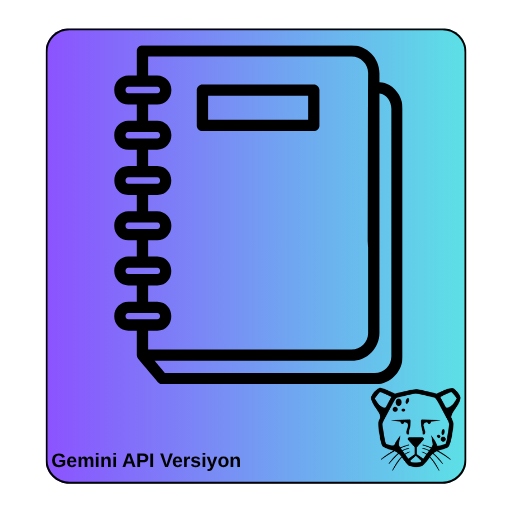
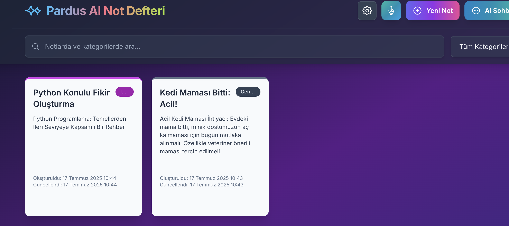
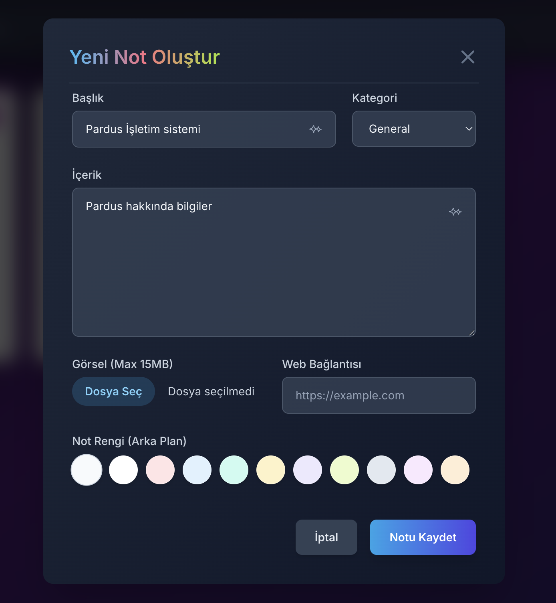
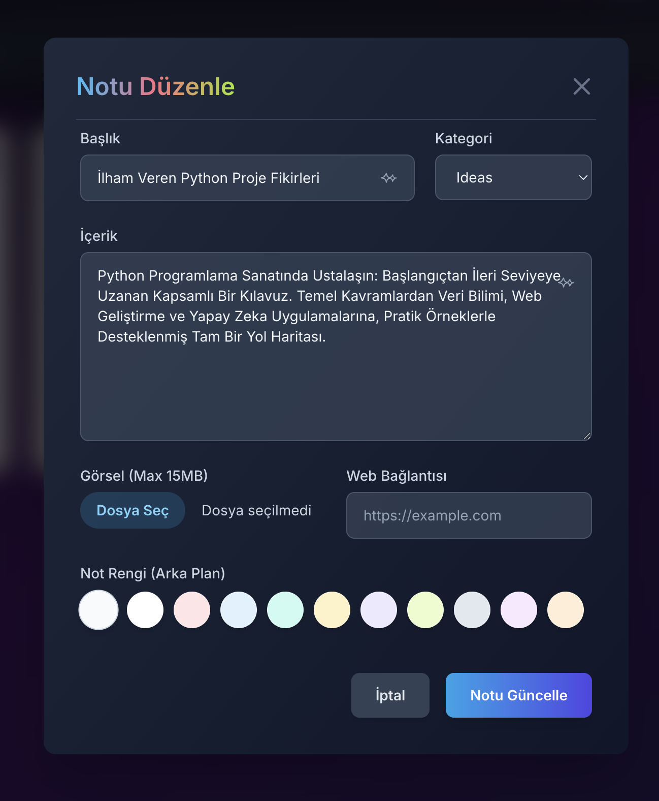
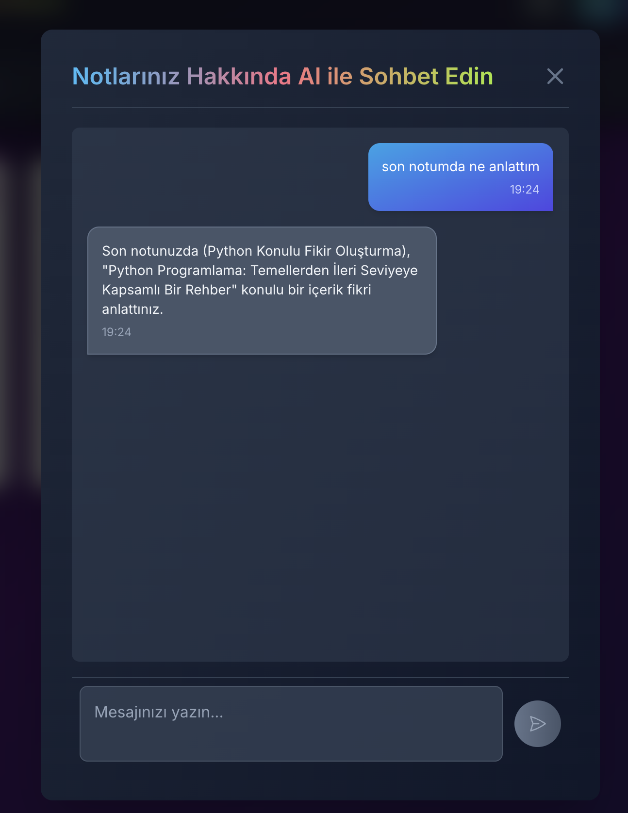
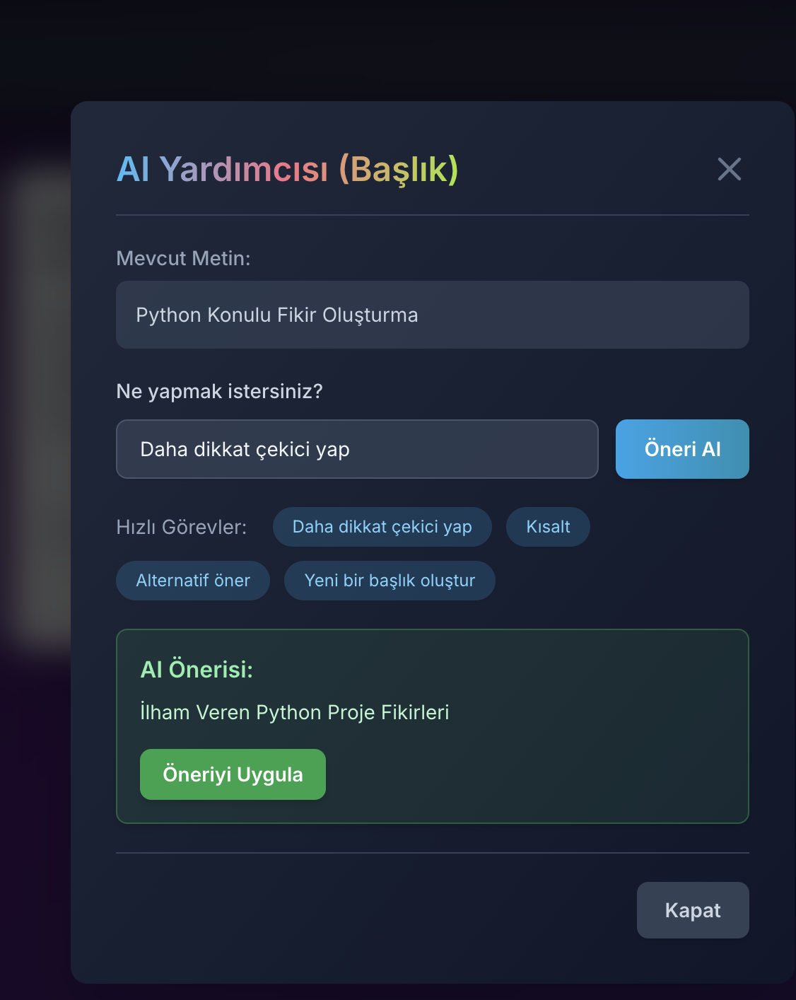
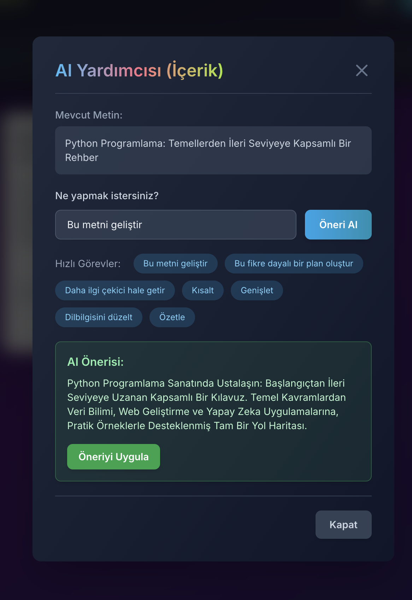
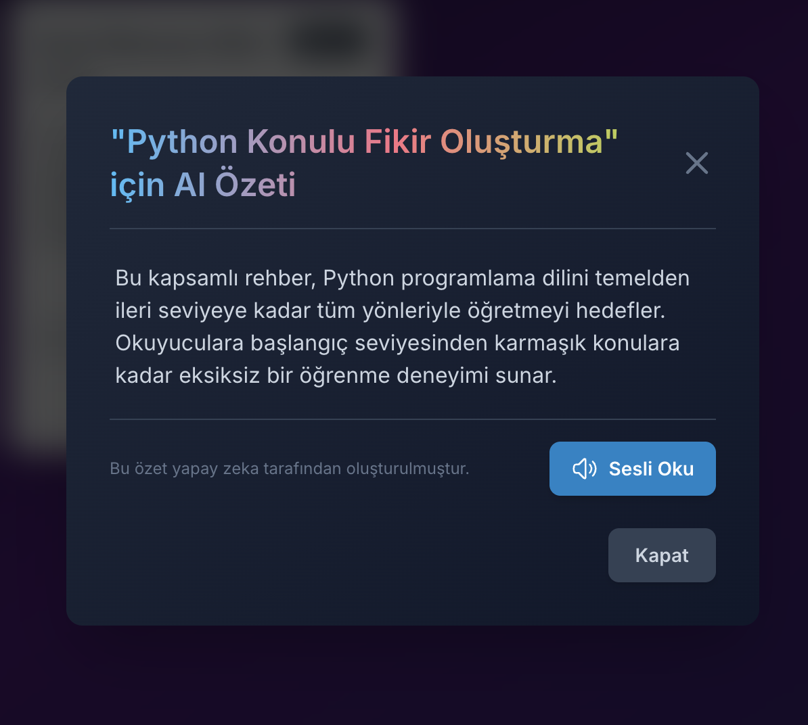
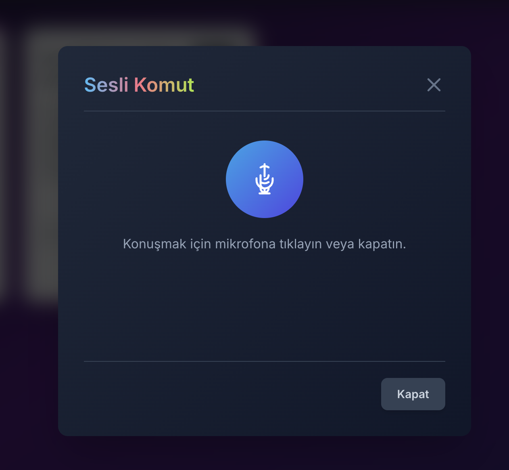
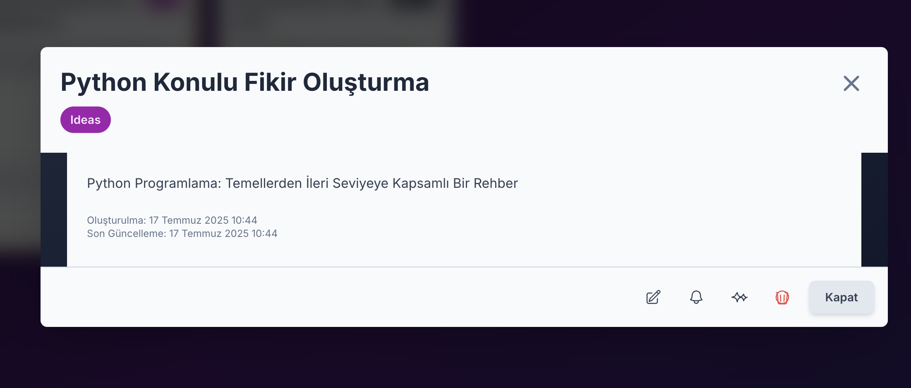

# Pardus Not Defteri with Gemini



## Amaç

Pardus Not Defteri, kullanıcıların not alma deneyimini modern yapay zeka (AI) yetenekleriyle birleştiren, zengin özelliklere sahip bir masaüstü not alma uygulamasıdır. Projenin temel amacı, geleneksel not alma işlevselliğini Google Gemini API destekli özelliklerle (örneğin, AI sohbet, not içeriği ve başlık önerileri, sesli notların metne çevrilmesi ve özetleme) birleştirerek kullanıcı verimliliğini, yaratıcılığını ve not yönetimi kolaylığını artırmaktır.

## Problem

Geleneksel not alma uygulamaları genellikle pasif araçlardır ve kullanıcıların notlarını düzenleme, yeni fikirler üretme veya mevcut bilgileri analiz etme süreçlerinde aktif destek sunmazlar. Bu durum, özellikle yoğun bilgi akışı olan ortamlarda veya yaratıcı süreçlerde kullanıcıların ek araçlara yönelmesine neden olur. Pardus Not Defteri, bu eksikliği gidererek not alma sürecini daha akıllı, etkileşimli ve verimli hale getirmeyi hedeflemektedir. Kullanıcılar artık sadece not almakla kalmayacak, aynı zamanda notları üzerinde AI destekli işlemler yaparak daha derinlemesine etkileşim kurabileceklerdir.

## Yöntem

Pardus Not Defteri, modern web teknolojileri (React, TypeScript) kullanılarak geliştirilmiş, Electron çerçevesi sayesinde platformlar arası (Windows, Linux, macOS) uyumluluk sağlayan bir masaüstü uygulamasıdır. Uygulamanın yapay zeka yetenekleri, Google Gemini API'nin güçlü doğal dil işleme ve multimodal yetenekleri entegre edilerek sağlanmıştır.

Uygulama mimarisi şu temel bileşenlere dayanmaktadır:

*   **Frontend (React & TypeScript)**: Kullanıcı arayüzü, React bileşenleri ve TypeScript ile geliştirilmiştir. Bu, uygulamanın ölçeklenebilirliğini ve bakımını kolaylaştırır.
*   **Masaüstü Entegrasyonu (Electron)**: Electron, web teknolojilerini kullanarak masaüstü uygulamaları geliştirmeyi sağlar. Bu sayede uygulamanın yerel dosya sistemine erişimi ve işletim sistemi entegrasyonu mümkün olmaktadır.
*   **AI Servisleri (Google Gemini API)**: `services/geminiService.ts` üzerinden Gemini API ile etkileşim kurulur. Bu servis, metin özetleme, içerik ve başlık önerileri, sesli komut işleme ve AI sohbet gibi özellikleri sunar.
*   **Ses İşleme (Web Audio API & MediaRecorder)**: `hooks/useAudioRecorder.ts` ve `services/speechService.ts` dosyaları, ses kaydı, sesin metne dönüştürülmesi (transkripsiyon) ve metnin sese dönüştürülmesi (text-to-speech) gibi sesle ilgili işlevleri yönetir.
*   **Yerel Depolama**: Notlar, kullanıcının yerel cihazında güvenli bir şekilde depolanır, bu da veri gizliliği ve çevrimdışı erişim sağlar.

Bu yöntem, kullanıcı dostu bir arayüz ile güçlü AI yeteneklerini bir araya getirerek, not alma deneyimini dönüştürmeyi amaçlamaktadır.

## Kullanılan Teknolojiler

*   **Programlama Dilleri**: TypeScript, JavaScript
*   **Frontend Çerçevesi**: React (v19.1.0)
*   **Masaüstü Çerçevesi**: Electron (v35.1.2)
*   **Derleme Aracı**: Vite (v6.2.0)
*   **Stil Yönetimi**: Tailwind CSS (v3.4.17), PostCSS (v8.5.6), Autoprefixer (v10.4.21)
*   **Yapay Zeka API'si**: Google Gemini API (`@google/genai` v1.6.0)
*   **HTTP İstemcisi**: Axios (v1.8.4)
*   **Durum Yönetimi**: React Hooks
*   **Ses Kaydı ve İşleme**: Web Audio API, MediaRecorder API (`useAudioRecorder` hook)
*   **Konuşma Sentezi**: Web Speech API (`speechService.ts`)
*   **Geliştirme Araçları**: ESLint, concurrently, electron-builder, wait-on

## Kurulum

Projeyi yerel ortamınızda çalıştırmak için aşağıdaki adımları izleyin:

1.  **Depoyu Klonlayın**: 
    ```bash
    git clone https://github.com/denizzhansahin/pardus-projeler-teknofest-2025.git
    cd pardus-projeler-teknofest-2025/pardus-not-defteri
    ```
2.  **Bağımlılıkları Yükleyin**: 
    ```bash
    npm install
    ```
3.  **Ortam Değişkenlerini Ayarlayın**: 
    Projenin kök dizininde (`pardus-not-defteri/`) `.env.local` adında bir dosya oluşturun ve Google Gemini API anahtarınızı ekleyin:
    ```
    VITE_GEMINI_API_KEY=YOUR_GEMINI_API_KEY
    ```
    `YOUR_GEMINI_API_KEY` kısmını kendi Gemini API anahtarınızla değiştirin. Bu anahtar, uygulamanın AI özelliklerini kullanabilmesi için gereklidir.
4.  **Uygulamayı Başlatın**: 
    Geliştirme modunda uygulamayı başlatmak için:
    ```bash
    npm run electron:dev
    ```
    Bu komut, Vite geliştirme sunucusunu başlatacak ve ardından Electron uygulamasını çalıştıracaktır.

    Üretim için derlemek ve çalıştırmak için:
    ```bash
    npm run electron:build
    # Ardından işletim sisteminize uygun olarak release klasöründeki çıktıyı çalıştırın.
    ```
    Örneğin, Windows için: `npm run electron:build-win`
    Linux için: `npm run electron:build-linux`
    macOS (Intel) için: `npm run electron:build-mac-intel`

## Gemini API Nasıl Kullanılır?

Pardus Not Defteri, not alma deneyiminizi zenginleştirmek için Google Gemini API'sini kapsamlı bir şekilde kullanır. API entegrasyonu, `services/geminiService.ts` dosyasında merkezi olarak yönetilmektedir. Uygulama içinde Gemini API, aşağıdaki temel özellikler için kullanılır:

*   **AI Sohbet (`AiChatModal.tsx`)**: Kullanıcılar, notlarıyla ilgili sorular sormak, genel konularda bilgi almak veya yaratıcı metinler oluşturmak için AI ile doğal dilde sohbet edebilirler. AI, kullanıcının mevcut notlarını bağlam olarak kullanarak daha alakalı yanıtlar sunar.
*   **AI Yardımcı (`AiHelperModal.tsx`)**: Not oluşturma veya düzenleme sırasında, AI'dan başlık veya içerik önerileri alınabilir. Bu özellik, yazma tıkanıklığını aşmaya, metinleri geliştirmeye, kısaltmaya veya genişletmeye yardımcı olur.
*   **Sesli Komut İşleme (`VoiceCommandModal.tsx`)**: Kullanıcılar sesli komutlar vererek yeni notlar oluşturabilirler. Gemini API, ses kaydını metne dönüştürür (`transcribeAudioWithAI`) ve ardından bu metni analiz ederek not başlığı, içeriği ve kategorisi gibi bilgileri çıkarır (`processVoiceCommand`). AI, kullanıcının mevcut notlarını da dikkate alarak daha akıllı notlar oluşturmaya çalışır.
*   **Not Özetleme**: Uzun notların içeriği, Gemini API kullanılarak hızlıca özetlenebilir. Bu, kullanıcıların notların ana fikirlerini çabucak kavramasına olanak tanır.

API anahtarınızı ise "Ayarlar" bölümüne ekledikten sonra, uygulamanın tüm AI destekli özelliklerini kullanmaya başlayabilirsiniz.

## Ekran Görüntüleri

Uygulamanın temel arayüzlerini ve özelliklerini gösteren ekran görüntüleri:

*   
*   
*   
*   
*   
*   
*   
*   
    

## Takım Bilgisi

*   **Danışman**: Mehmet Akınol
*   **Üye**: Denizhan Şahin
*   **Başvuru ID**: 3078008
*   **Takım ID**: 577125
*   **Takım Adı**: Space Teknopoli Linux Team
*   **Yarışma Adı**: 2025 Pardus Hata Yakalama ve Öneri Yarışması Geliştirme Kategorisi