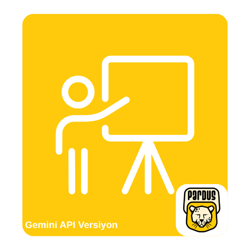
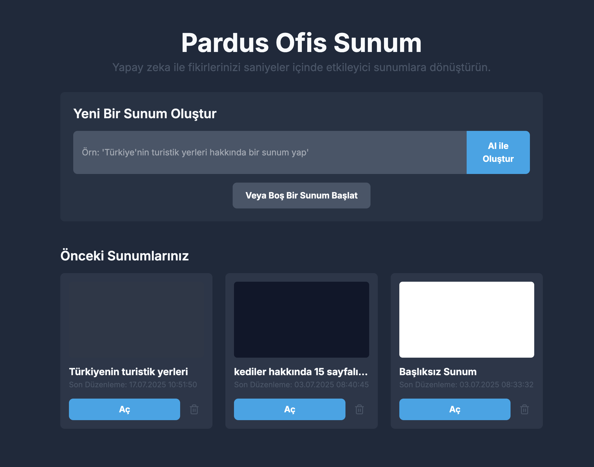
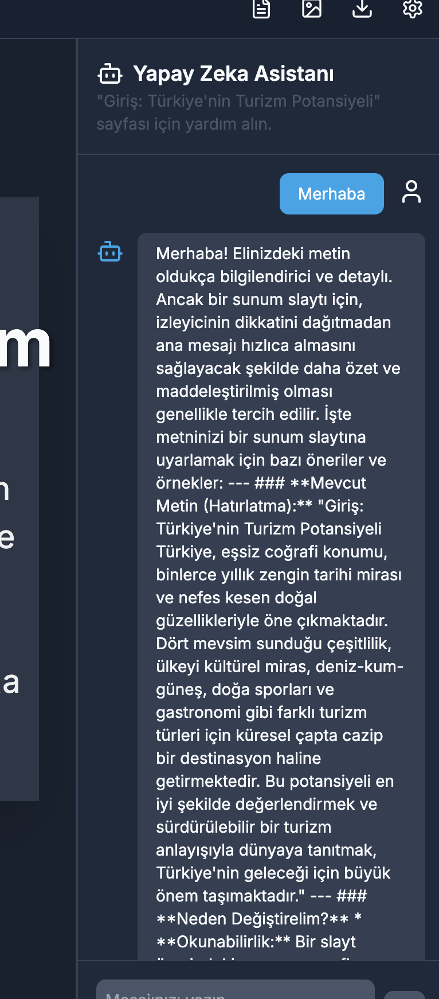
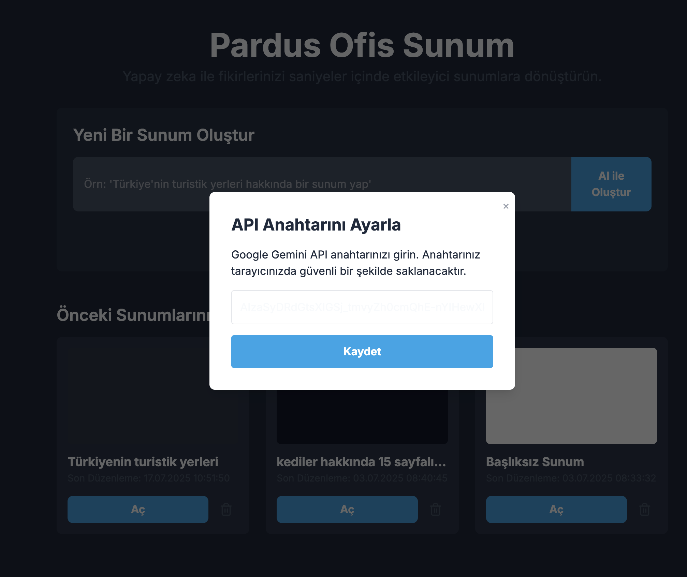
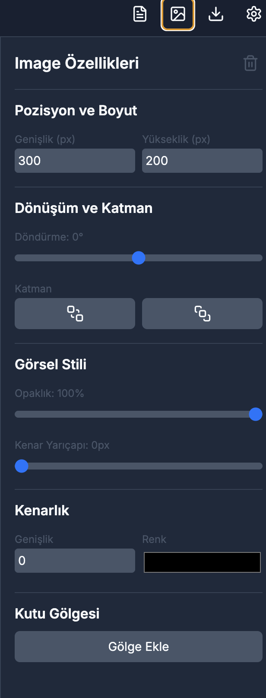
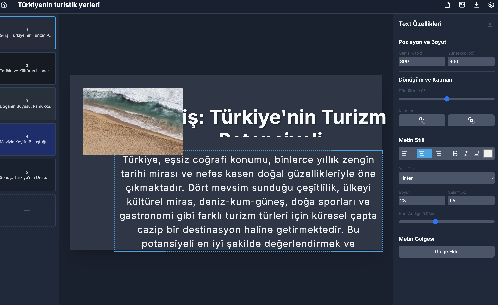

# Pardus Ofis Sunum



## Amaç

Pardus Ofis Sunum, kullanıcıların yapay zeka destekli araçlarla hızlı ve etkili bir şekilde profesyonel sunumlar oluşturmasını sağlamayı amaçlayan bir masaüstü uygulamasıdır. Proje, sunum hazırlama sürecini otomatize ederek ve yapay zeka tabanlı öneriler sunarak kullanıcı verimliliğini artırmayı hedefler.

## Problem

Geleneksel sunum hazırlama süreçleri genellikle zaman alıcı ve zahmetlidir. Kullanıcılar, içerik oluşturma, tasarım seçimi ve düzenleme gibi adımlarda zorluklar yaşayabilirler. Bu proje, bu zorlukları aşarak, özellikle içerik oluşturma ve görselleştirme aşamalarında yapay zeka desteği ile bu süreci kolaylaştırmayı hedefler.

## Yöntem

Pardus Ofis Sunum, Google Gemini API'nin güçlü yapay zeka yeteneklerini kullanarak sunum oluşturma sürecini dönüştürür. Uygulama, kullanıcıdan alınan konulara göre otomatik olarak sunum taslakları oluşturur, slayt içeriklerini detaylandırır, tasarımları yeniden düzenler ve hatta görseller üretir. Ayrıca, kullanıcılara sunumları üzerinde sohbet tabanlı yardım sunarak interaktif bir deneyim sağlar. Electron framework'ü sayesinde masaüstü uygulaması olarak çalışır.

## Kullanılan Teknolojiler

*   **Programlama Dilleri**: TypeScript, JavaScript
*   **Frontend Framework**: React
*   **Masaüstü Uygulama Framework**: Electron
*   **Paket Yöneticisi**: npm
*   **Derleyici/Bileştirici**: Vite
*   **Yapay Zeka API**: Google Gemini API (`@google/genai`)
*   **UI Kütüphaneleri**: `lucide-react` (ikonlar), `tailwindcss` (CSS framework)
*   **Görüntü İşleme**: `html-to-image`
*   **PDF Oluşturma**: `jspdf`
*   **Dosya Sıkıştırma**: `jszip`

## Kurulum

Projeyi yerel ortamınızda çalıştırmak için aşağıdaki adımları izleyin:

1.  **Depoyu Klonlayın**:
    ```bash
    git clone https://github.com/denizzhansahin/pardus-projeler-teknofest-2025.git
    cd pardus-projeler-teknofest-2025/pardus-ofis-sunum
    ```

2.  **Bağımlılıkları Yükleyin**:
    ```bash
    npm install
    ```

3.  **Geliştirme Modunda Çalıştırın**:
    ```bash
    npm run electron:dev
    ```

4.  **Uygulamayı Derleyin (İsteğe Bağlı)**:
    Platformunuza göre aşağıdaki komutlardan birini kullanabilirsiniz:
    *   Windows için:
        ```bash
        npm run electron:build-win
        ```
    *   Linux için:
        ```bash
        npm run electron:build-linux
        ```
    *   macOS (Intel) için:
        ```bash
        npm run electron:build-mac-intel
        ```
    *   macOS (ARM64) için (varsayılan):
        ```bash
        npm run electron:build
        ```

## Gemini API Nasıl Kullanılır?

Pardus Ofis Sunum, Google Gemini API'yi kullanarak çeşitli yapay zeka destekli özellikler sunar. API anahtarınız uygulamanın ayarlar menüsünden girilir ve yerel depolamada (`localStorage`) saklanır.

**Görsel oluşturma özelliği için Google AI Studio üzerinden mevcut bir "Billing" özelliği açık Cloud projenizin API key bilgisini kullanmanız gerekmektedir.


Uygulama, Gemini API'yi aşağıdaki amaçlarla kullanır:

*   **Sunum Taslağı Oluşturma**: Kullanıcının verdiği konuya göre slayt başlıkları ve özetleri içeren bir sunum taslağı oluşturur (`generatePresentationOutline`).
*   **Slayt Detayları Oluşturma**: Her bir slayt için arka plan rengi ve metin öğeleri gibi görsel detayları yapay zeka ile tasarlar (`generateSlideDetails`).
*   **Slayt Yeniden Tasarımı**: Mevcut bir slaytın içeriğini koruyarak tamamen yeni bir görsel tasarımla yeniden düzenler (`redesignSlide`).
*   **Sohbet Asistanı**: Kullanıcının sunum içeriği hakkında sorular sormasına ve yapay zeka ile etkileşim kurmasına olanak tanır (`chatOnSlide`).
*   **Görsel Oluşturma**: Kullanıcının metin açıklamalarına göre görseller üretir (`generateImage`).
*   **Görsel İstemi Geliştirme**: Kullanıcının verdiği görsel istemlerini yapay zeka için daha uygun hale getirir (`enhanceImagePrompt`).

## Ekran Görüntüleri

İşte uygulamanın bazı temel arayüzlerinin ekran görüntüleri:

*   
*   
*   
*   
*   
*   
*   

## Takım Bilgisi

*   **Danışman**: Mehmet Akınol
*   **Üye**: Denizhan Şahin
*   **Başvuru ID**: 3078008
*   **Takım ID**: 577125
*   **Takım Adı**: Space Teknopoli Linux Team
*   **Yarışma Adı**: 2025 Pardus Hata Yakalama ve Öneri Yarışması Geliştirme Kategorisi