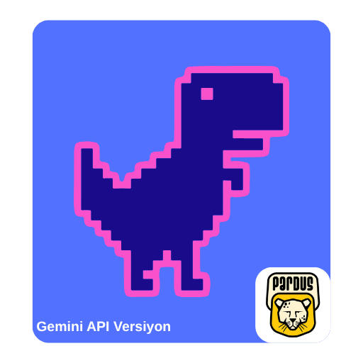
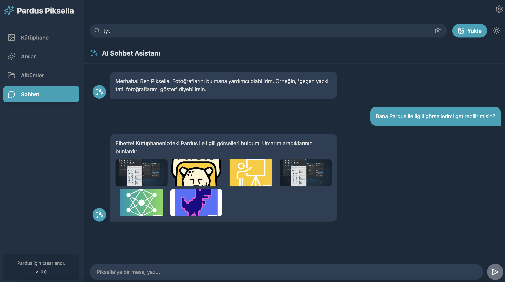
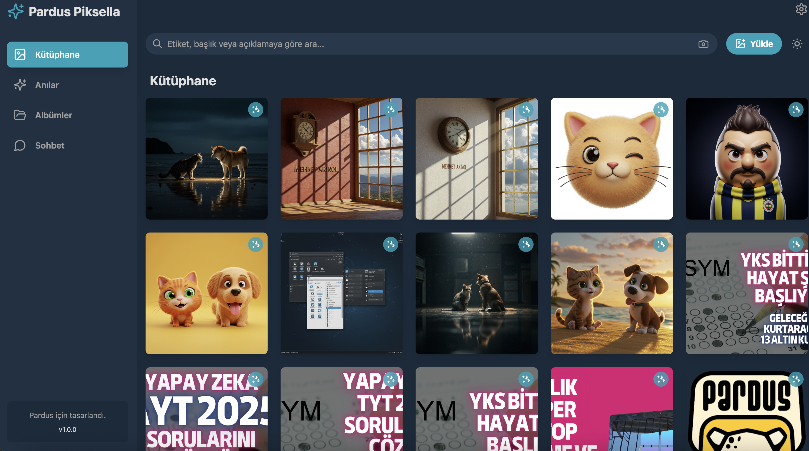
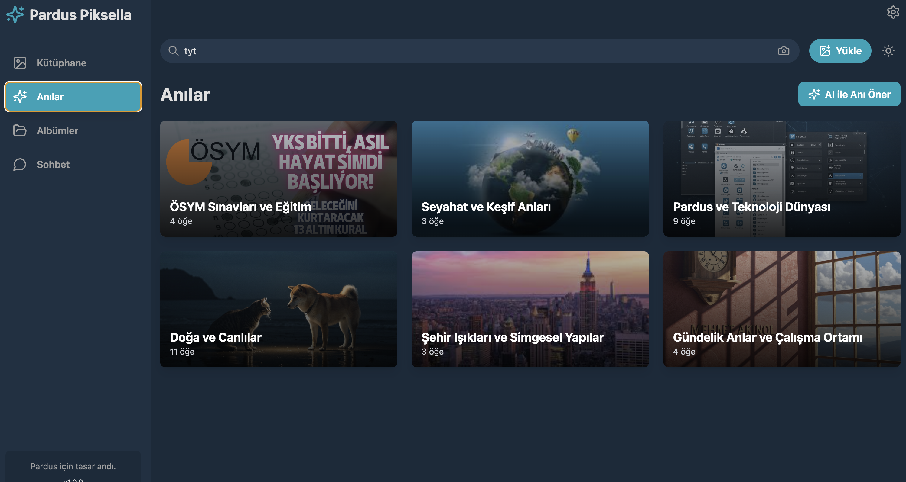
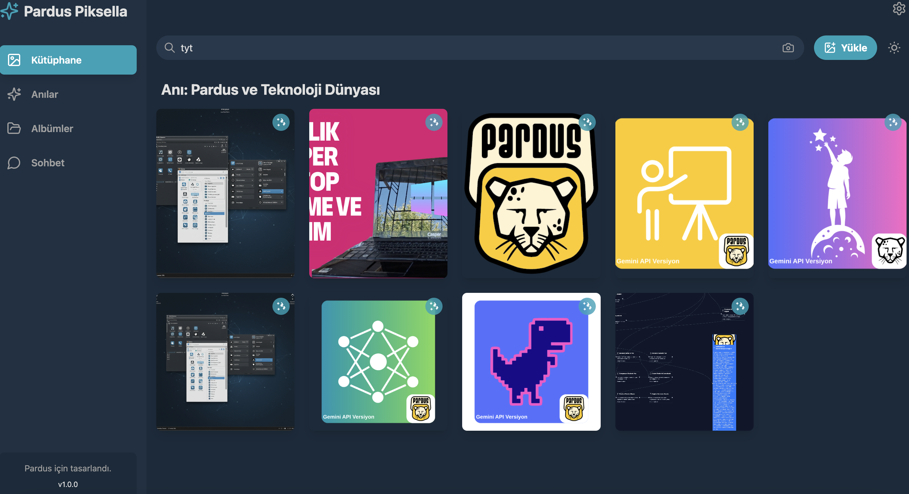
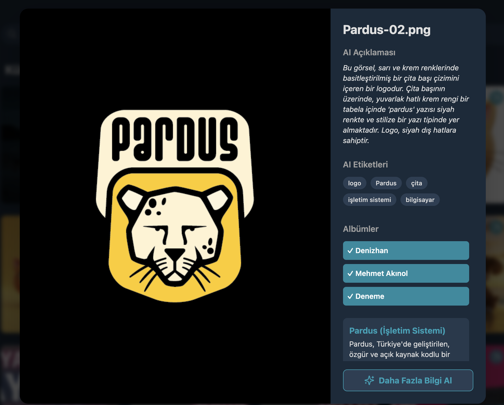

# Pardus Piksella



## Amaç

Pardus Piksella, kullanıcıların fotoğraf ve medya kütüphanelerini yapay zeka destekli özelliklerle daha verimli bir şekilde yönetmelerini, organize etmelerini ve anlamlandırmalarını sağlayan bir masaüstü uygulamasıdır. Projenin temel amacı, geleneksel fotoğraf galerisi deneyimini akıllı analiz, otomatik etiketleme, anı oluşturma ve sohbet tabanlı etkileşimlerle zenginleştirmektir.

## Problem

Günümüz dijital çağında, kullanıcılar giderek artan sayıda fotoğraf ve video çekmekte, bu da büyük ve düzensiz medya kütüphanelerine yol açmaktadır. Bu durum, belirli bir fotoğrafı bulmayı zorlaştırmakta, değerli anıların gözden kaçmasına neden olmakta ve medya yönetimini sıkıcı bir görev haline getirmektedir. Pardus Piksella, bu dağınıklık problemini çözerek kullanıcıların medya içeriklerinden maksimum fayda sağlamasına yardımcı olmayı hedeflemektedir.

## Yöntem

Pardus Piksella, bu problemi çözmek için Google Gemini API'nin güçlü yapay zeka yeteneklerini kullanır. Uygulama, görselleri otomatik olarak analiz eder, içeriklerine göre etiketler ve açıklamalar oluşturur. Ayrıca, benzer temalara sahip fotoğrafları gruplayarak "anılar" oluşturur ve kullanıcının medya kütüphanesinden günlük özetler sunar. Kullanıcılar, doğal dil kullanarak yapay zeka asistanıyla sohbet edebilir ve belirli fotoğrafları veya anıları kolayca bulabilirler. Uygulama, yerel depolama (IndexedDB) kullanarak kullanıcı verilerinin gizliliğini ve performansını sağlar.

## Kullanılan Teknolojiler

*   **Frontend**: React, Vite, TypeScript
*   **Masaüstü Uygulama Çerçevesi**: Electron
*   **Yapay Zeka Entegrasyonu**: Google Gemini API (`@google/genai`)
*   **Veritabanı**: IndexedDB (`idb` kütüphanesi ile)
*   **UI Bileşenleri**: Lucide React
*   **Stil**: Tailwind CSS (PostCSS ve Autoprefixer ile)
*   **Geliştirme Araçları**: ESLint, Concurrently, Wait-on

## Kurulum

Projeyi yerel ortamınızda çalıştırmak için aşağıdaki adımları izleyin:

1.  Projeyi klonlayın:
    ```bash
    git clone https://github.com/denizzhansahin/pardus-projeler-teknofest-2025.git
    cd pardus-piksella
    ```
2.  Bağımlılıkları yükleyin:
    ```bash
    npm install
    ```
3.  Geliştirme modunda başlatın (Electron uygulamasını ve Vite geliştirme sunucusunu aynı anda çalıştırır):
    ```bash
    npm run electron:dev
    ```
4.  Uygulamayı derlemek için:
    *   Windows için:
        ```bash
        npm run electron:build-win
        ```
    *   Linux için:
        ```bash
        npm run electron:build-linux
        ```
    *   macOS (Intel) için:
        ```bash
        npm run electron:build-mac-intel
        ```
    *   Genel Electron derlemesi için:
        ```bash
        npm run electron:build
        ```

## Gemini API Nasıl Kullanılır?

Pardus Piksella, Google Gemini API'yi medya analizi ve etkileşimli özellikler için yoğun bir şekilde kullanır. `services/geminiService.ts` dosyası, API ile etkileşimi yöneten ana mantığı içerir:

*   **Görsel Analizi (`analyzeImage`)**: Yüklenen görselleri analiz eder, Türkçe açıklamalar ve etiketler (tags) oluşturur.
*   **Anahtar Kelime Çıkarımı (`getKeywordsForImageSearch`)**: Görsel arama için anahtar kelimeler çıkarır.
*   **Anı Önerileri (`suggestMemories`)**: Kullanıcının medya kütüphanesindeki görsellerden ortak temalara göre anılar oluşturur.
*   **Günlük Özet (`getDailyHighlight`)**: Medya kütüphanesinden günün öne çıkan görsellerini ve kısa bir özetini sunar.
*   **Daha Fazla Bilgi (`getMoreInfo`)**: Bir görseldeki ana konu hakkında ansiklopedik bilgi sağlar.
*   **Yapay Zeka Sohbeti (`chatWithAI`)**: Kullanıcının medya kütüphanesi hakkında doğal dil ile sohbet etmesini sağlar.

**API Anahtarı**: Uygulamanın çalışabilmesi için bir Gemini API anahtarı gereklidir. Bu anahtar, uygulamanın yerel depolamasında (`localStorage`) `PARDUS_PIKSELLA_API_KEY` olarak saklanır. Bunun için API key bilginizi "Ayarlar" bölümüne ekleyiniz.

## Ekran Görüntüleri

Aşağıda uygulamanın temel arayüzlerini gösteren ekran görüntüleri bulunmaktadır:

*   
*   
*   
*   
*   
*   
*   
*   

## Takım Bilgisi

*   **Üyeler**: Denizhan Şahin, Mehmet Akınol
*   **Başvuru ID**: 3078008
*   **Takım ID**: 577125
*   **Takım Adı**: Space Teknopoli Linux Team
*   **Yarışma Adı**: 2025 Pardus Hata Yakalama ve Öneri Yarışması Geliştirme Kategorisi