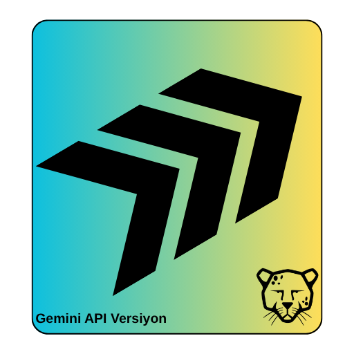
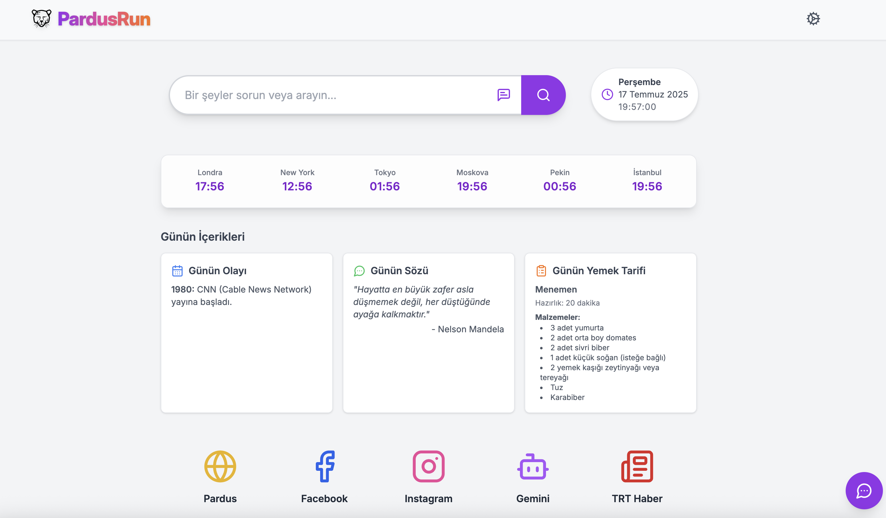
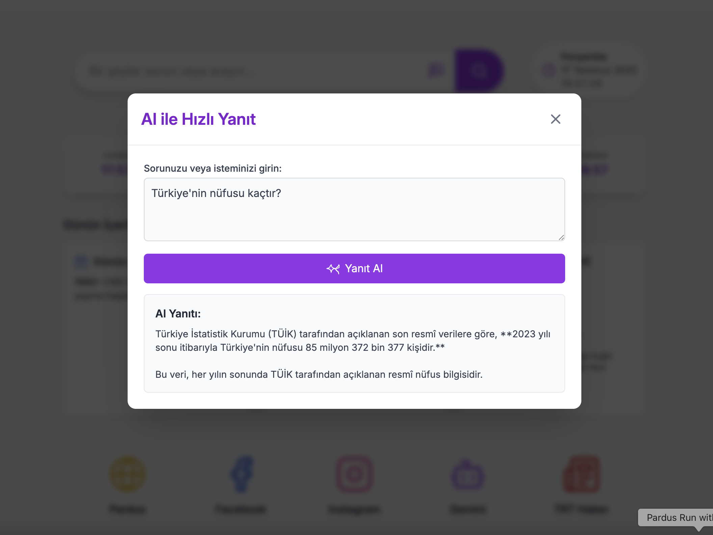
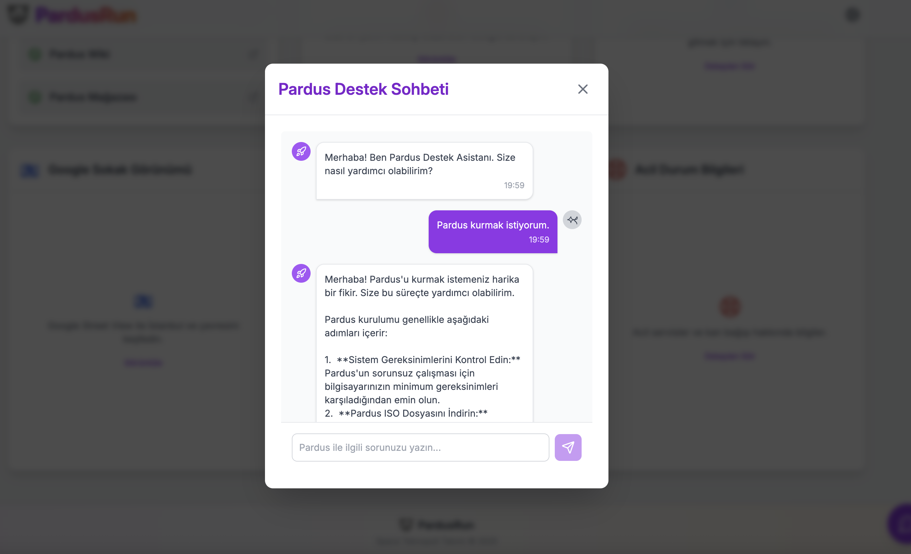
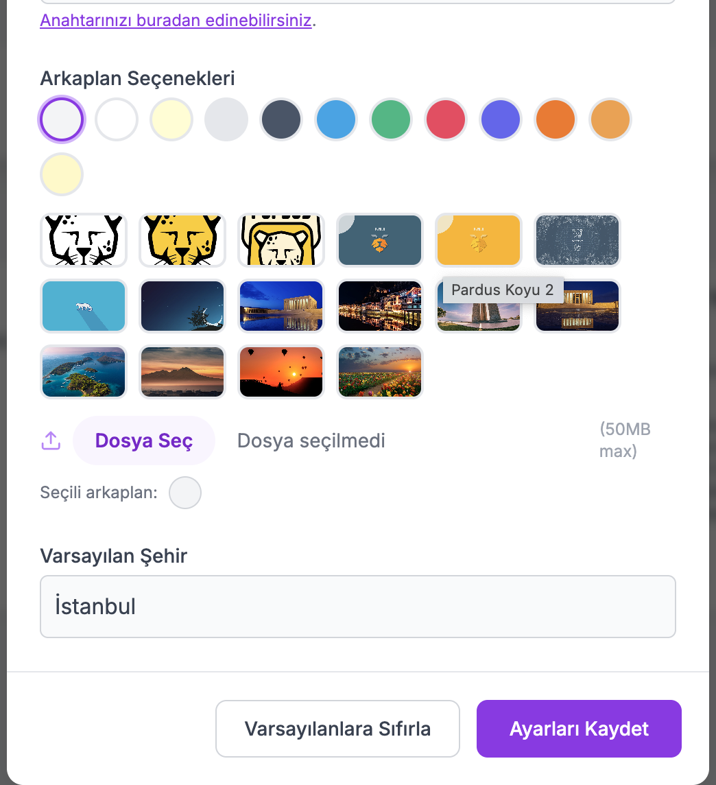

# PardusRun Dashboard Hızlı Başlangıç ve Açılış Uygulaması

## Logo


## Amaç
PardusRun Dashboard, Pardus kullanıcıları için tasarlanmış, hızlı başlangıç ve günlük işlemleri kolaylaştıran kapsamlı bir masaüstü uygulamasıdır. Temel amacı, kullanıcıların sık kullandığı bilgilere, araçlara ve kısayollara tek bir merkezi arayüzden erişimini sağlayarak dijital deneyimlerini optimize etmek ve verimliliklerini artırmaktır. Uygulama, kişiselleştirilebilir widget'lar ve yapay zeka destekli özelliklerle zenginleştirilmiş bir kontrol paneli sunar.

## Problem
Modern işletim sistemlerinde kullanıcılar, farklı görevleri yerine getirmek veya bilgiye ulaşmak için çeşitli uygulamalar ve web siteleri arasında sürekli geçiş yapmak zorunda kalabilirler. Bu durum, zaman kaybına ve dağınık bir çalışma ortamına yol açabilir. PardusRun Dashboard, bu parçalı yapıyı ortadan kaldırarak, hava durumu, haberler, müzik önerileri, oyunlar, günlük içgörüler ve yapay zeka destekli hızlı yanıtlar gibi birçok özelliği tek bir entegre platformda birleştirerek kullanıcıların ihtiyaç duyduğu her şeye anında erişimini sağlar.

## Yöntem
PardusRun Dashboard, modern web teknolojilerinin gücünü masaüstü uygulaması esnekliğiyle birleştiren hibrit bir yaklaşımla geliştirilmiştir. React ve TypeScript ile dinamik ve etkileşimli bir kullanıcı arayüzü oluşturulmuş, bu arayüz Electron framework'ü sayesinde platformlar arası uyumlu bir masaüstü uygulamasına dönüştürülmüştür. Uygulama, modüler widget mimarisi sayesinde kolayca genişletilebilir ve yeni özellikler eklenebilir. Google Gemini API entegrasyonu ile yapay zeka destekli akıllı özellikler sunulmaktadır. Tailwind CSS gibi utility-first bir CSS framework'ü kullanılarak hızlı ve tutarlı bir tasarım sağlanmıştır.

## Kullanılan Teknolojiler
*   **Programlama Dilleri**: TypeScript, JavaScript
*   **Frontend Framework**: React (v19.1.0)
*   **Masaüstü Uygulama Framework**: Electron (v35.1.2)
*   **Build Tool**: Vite (v6.2.0)
*   **Paket Yöneticisi**: npm
*   **Yapay Zeka API**: Google Gemini API (`@google/genai` v1.6.0)
*   **İkon Kütüphanesi**: Lucide React (`lucide-react` v0.523.0)
*   **Styling**: Tailwind CSS (PostCSS ve Autoprefixer ile)
*   **Geliştirme Araçları**: ESLint, TypeScript-ESLint, Concurrenty, Wait-on

## Kurulum
Projeyi yerel ortamınızda çalıştırmak için aşağıdaki adımları takip edin:

1.  **Depoyu Klonlayın**:
    ```bash
    git clone https://github.com/denizzhansahin/pardus-projeler-teknofest-2025.git
    cd pardusrun-dashboard
    ```

2.  **Bağımlılıkları Yükleyin**:
    ```bash
    npm install
    ```

3.  **Gemini API Anahtarını Yapılandırın**:
    Projenin yapay zeka özelliklerini kullanabilmek için bir Google Gemini API anahtarına ihtiyacınız vardır. `pardusrun-dashboard` dizininin kökünde `.env.local` adında bir dosya oluşturun ve API anahtarınızı aşağıdaki gibi ekleyin:
    ```
    VITE_GEMINI_API_KEY=YOUR_GEMINI_API_KEY_HERE
    ```
    `YOUR_GEMINI_API_KEY_HERE` kısmını kendi Gemini API anahtarınızla değiştirin.

4.  **Uygulamayı Başlatın (Geliştirme Modu)**:
    ```bash
    npm run electron:dev
    ```
    Bu komut, hem Vite geliştirme sunucusunu başlatacak hem de Electron uygulamasını çalıştıracaktır.

5.  **Uygulamayı Derleyin (Üretim Modu)**:
    ```bash
    npm run electron:build
    ```
    Bu komut, uygulamanın üretim için derlenmiş sürümünü `release` klasörüne oluşturacaktır. Windows, Linux veya macOS için özel derleme komutları `package.json` dosyasında mevcuttur (örn: `electron:build-win`, `electron:build-linux`, `electron:build-mac-intel`).

## Gemini API Nasıl Kullanılır?
PardusRun Dashboard, Google Gemini API'sini çeşitli akıllı özellikler sunmak için kapsamlı bir şekilde kullanır. `services/geminiService.ts` dosyası tüm API etkileşimlerini yönetir. Entegre edilen başlıca Gemini özellikleri şunlardır:

*   **AI Hızlı Yanıt**: Merkezi arama çubuğundan veya özel bir modal üzerinden genel sorulara hızlı ve doğrudan yapay zeka yanıtları alın.
*   **Pardus Destek Sohbeti**: Pardus işletim sistemiyle ilgili sorularınız için yapay zeka destekli bir sohbet asistanı ile etkileşim kurun.
*   **Günlük İçgörüler**: Günün olayı, günün sözü ve günün tarifi gibi dinamik içerikleri görüntüleyin.
*   **Haberler, Müzik ve Video Önerileri**: Çeşitli kategorilerde güncel haber başlıkları, müzik parçaları ve YouTube video önerileri alın.
*   **Hava Durumu**: Belirlediğiniz şehir için güncel hava durumu bilgilerini görüntüleyin.
*   **Görsel Oluşturma**: Metin istemlerinden yapay zeka destekli görseller oluşturun.
*   **Çeviri**: Metinleri farklı dillere çevirin.
*   **Pardus Uygulama ve Kısayol Önerileri**: Belirli ihtiyaçlara yönelik Pardus uyumlu uygulama ve klavye kısayolu önerileri alın.

**API Anahtarı**: Uygulamanın çalışabilmesi için bir Gemini API anahtarı gereklidir. Bu anahtar, uygulamanın yerel depolamasında (`localStorage`) olarak saklanır. Bunun için API key bilginizi "Ayarlar" bölümüne ekleyiniz.

**Görsel oluşturma özelliği için Google AI Studio üzerinden mevcut bir "Billing" özelliği açık Cloud projenizin API key bilgisini kullanmanız gerekmektedir.
## Ekran Görüntüleri
*   
*   
*   
*   
*   
*   

## Takım Bilgisi
*   **Üyeler**: Denizhan Şahin, Mehmet Akınol
*   **Başvuru ID**: 3078008
*   **Takım ID**: 577125
*   **Takım Adı**: Space Teknopoli Linux Team
*   **Yarışma Adı**: 2025 Pardus Hata Yakalama ve Öneri Yarışması Geliştirme Kategorisi